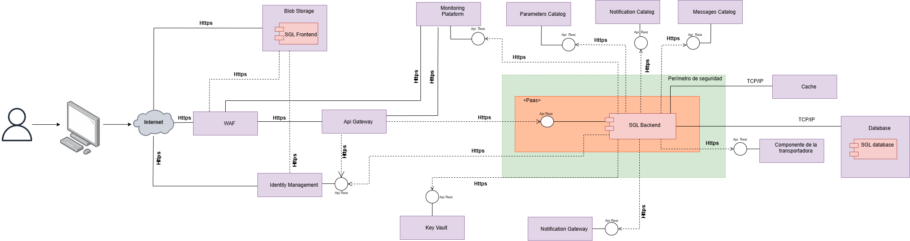
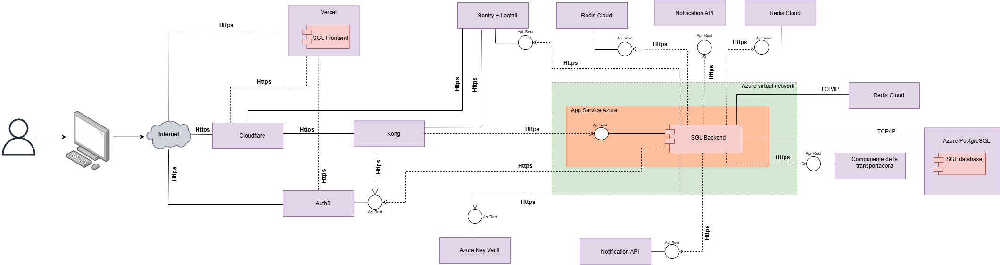
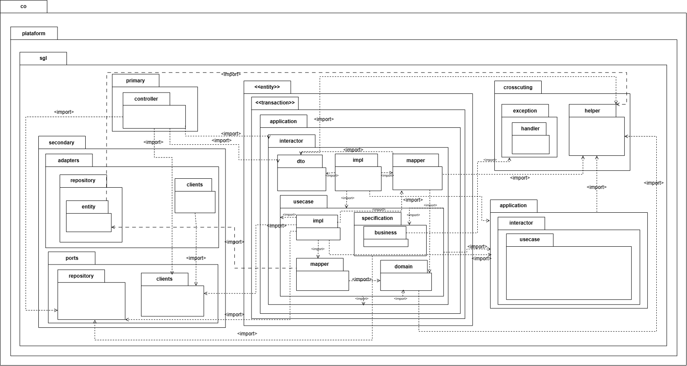
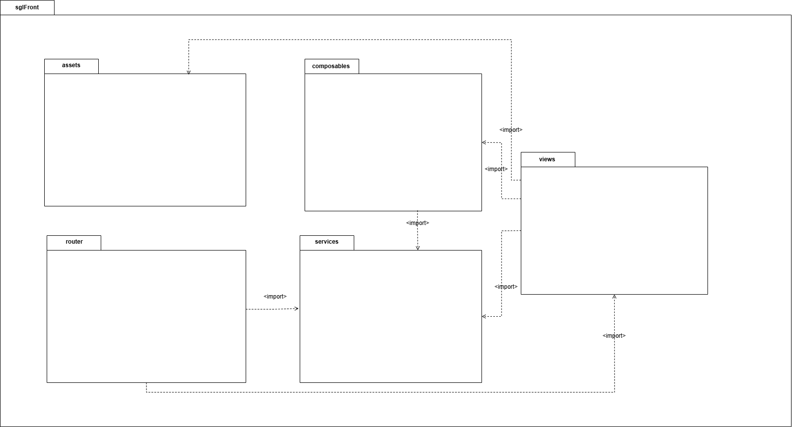
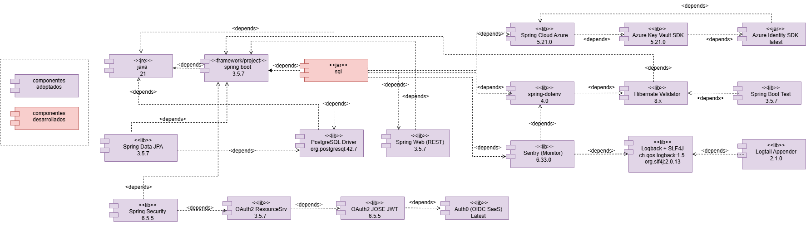
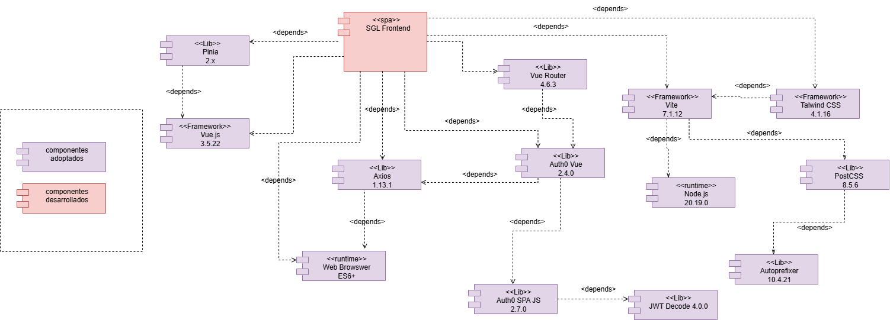
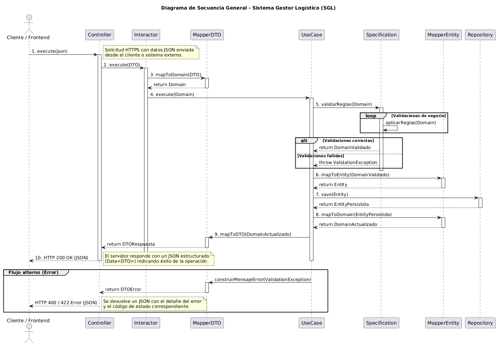
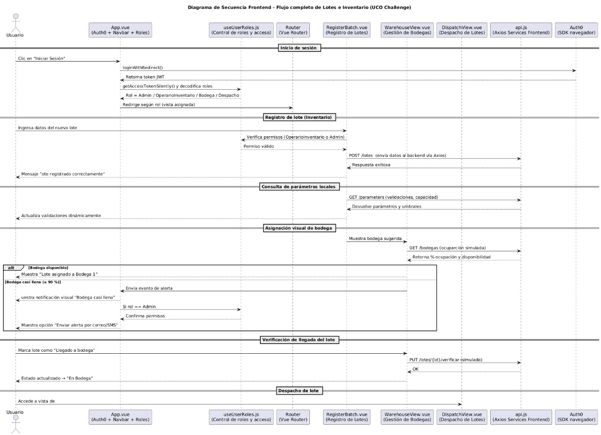

## Proyecto

**Sistema Gestor de Logística (SGL)**  
 

## Arquitectos

- **Maria Andrea Avendaño Jurado**  
- **Alexandra Puerta Bustamante**

---

## Contenido

1. [Objetivo del proyecto](#1-objetivo-del-proyecto)
2. [Drivers Arquitectónicos](#2-drivers-arquitectónicos)
   - [Escenarios de calidad](#21-escenarios-de-calidad)
   - [Restricciones funcionales](#22-restricciones-funcionales)
   - [Restricciones técnicas adoptadas](#23-restricciones-técnicas-adoptadas)
   - [Restricciones de negocio](#24-restriccciones-de-negocio)
3. [Alternativa de Solución](#3-alternativa-de-solución)
   - [Arquitectura de referencia](#31-arquitectura-de-referencia)
   - [Arquetipo de referencia](#32-arquetipo-de-referencia)
4. [Diagrama de paquetes](#4-diagrama-de-paquetes)
   - [4.1 Diagrama de paquetes - Frontend](#41-diagrama-de-paquetes----frontend)
5. [Diagrama de componentes](#5-diagrama-de-componentes)
   - [5.1 Diagrama de componentes - Frontend](#51-diagrama-de-componentes----frontend)
6. [Diagrama de secuencia](#6-diagrama-de-secuencia)
   - [6.1 Diagrama de secuencia — Frontend](#61-diagrama-de-secuencia---frontend)
7. [Diagrama de despliegue](#7-diagrama-de-despliegue)

---

# 1. Objetivo del proyecto

Diseñar e implementar un **Sistema Gestor de Logística (SGL)** que permita administrar de forma eficiente y trazable los procesos logísticos de una organización, facilitando la gestión de inventarios, lotes, almacenamiento y despacho de productos, mediante una arquitectura modular, escalable y segura que asegure la integridad de los datos y la correcta coordinación entre los diferentes roles operativos.

---

# 2. Drivers Arquitectónicos

## 2.1 Escenarios de calidad

### ESC-CAL-Confiabilidad-0001
| | |
|------------|------------|
| **Característica** | Se requiere que el sistema garantice la consistencia de la información durante operaciones críticas (creación o actualización de lotes y productos), asegurando que las transacciones se completen correctamente o se reviertan sin afectar la integridad de los datos. |
| **Identificador** | ESC-CAL-Confiabilidad-0001 |
| **Nombre** | Registro de lote exitoso con consistencia de datos |
| **Tipo** | Flujo básico |
| **Objetivo** | Asegurar que el sistema ejecute correctamente la transacción de registro de un lote, validando datos y confirmando su persistencia íntegra. |
| **Descripción** | Cuando un usuario crea un nuevo lote con información válida y completa, el sistema debe validar todos los campos, ejecutar la transacción de guardado y confirmar que los datos se registraron correctamente sin inconsistencias. |
| **Criterio de éxito** | El lote se almacena exitosamente, con integridad en todas las tablas relacionadas (producto, fecha, cantidad). Se muestra un mensaje de confirmación al usuario. |
| **Fuente del estímulo** | Usuario autenticado (operario de inventario). |
| **Estímulo** | Registro de un lote con datos completos y válidos. |
| **Ambiente** | Operación normal. |
| **Artefacto** | Componente de Confiabilidad (Transacciones). |
| **Respuesta** | El sistema guarda la información de forma consistente, confirmando éxito y registrando la operación en el log de auditoría. |
| **Medida de la respuesta** | La transacción se completa en menos de 3 segundos y se refleja inmediatamente en la base de datos. |
| **¿Cumplió?** | No |

---

### ESC-CAL-Confiabilidad-0002
| | |
|------------|------------|
| **Característica** | Se requiere que el sistema garantice la consistencia de las transacciones, evitando duplicidades durante el registro de lotes o productos. |
| **Identificador** | ESC-CAL-Confiabilidad-0002 |
| **Nombre** | Prevención de registro duplicado de lotes |
| **Tipo** | Flujo alterno |
| **Objetivo** | Evitar que el usuario registre dos lotes con el mismo código o identificador. |
| **Descripción** | Cuando el usuario intenta registrar un lote con un código que ya existe, el sistema debe detectar la duplicidad, impedir el guardado y mostrar un mensaje de advertencia proveniente del catálogo de mensajes. |
| **Criterio de éxito** | El sistema bloquea el registro duplicado, informa claramente al usuario y mantiene la base de datos sin cambios. |
| **Fuente del estímulo** | Usuario autenticado (operario de inventario). |
| **Estímulo** | Intento de registro de lote con código ya existente. |
| **Ambiente** | Operación normal. |
| **Artefacto** | Componente de Confiabilidad (Validaciones). |
| **Respuesta** | El sistema muestra un mensaje “El código de lote ya existe” y no ejecuta el guardado. |
| **Medida de la respuesta** | Detección inmediata (<1 segundo) del duplicado antes del guardado. |
| **¿Cumplió?** | No |

---

### ESC-CAL-Confiabilidad-0003
| | |
|------------|------------|
| **Característica** | Se requiere que el sistema mantenga la confiabilidad de los datos durante actualizaciones parciales de información. |
| **Identificador** | ESC-CAL-Confiabilidad-0003 |
| **Nombre** | Fallo de validación en actualización parcial |
| **Tipo** | Flujo alterno |
| **Objetivo** | Evitar que se actualice parcialmente un registro si alguna validación de campo falla. |
| **Descripción** | Si el usuario intenta actualizar un lote y uno de los campos no cumple con las validaciones establecidas (por ejemplo, cantidad negativa), el sistema debe cancelar la operación y mostrar un mensaje de error específico. |
| **Criterio de éxito** | Ningún cambio se aplica en la base de datos si ocurre una validación fallida; se notifica el error claramente al usuario. |
| **Fuente del estímulo** | Usuario autenticado. |
| **Estímulo** | Actualización de un lote con campo inválido. |
| **Ambiente** | Operación normal. |
| **Artefacto** | Componente de Confiabilidad (Validaciones). |
| **Respuesta** | El sistema revierte los cambios y muestra el mensaje de error desde el catálogo de mensajes. |
| **Medida de la respuesta** | Reversión inmediata, sin modificación en registros asociados. |
| **¿Cumplió?** | No |

---

### ESC-CAL-Confiabilidad-0004
| | |
|------------|------------|
| **Característica** | Se requiere que el sistema asegure la integridad de los datos ante un fallo inesperado durante el proceso de guardado. |
| **Identificador** | ESC-CAL-Confiabilidad-0004 |
| **Nombre** | Reversión automática ante fallo en transacción |
| **Tipo** | Flujo excepcional |
| **Objetivo** | Asegurar que si ocurre un error interno durante el registro o actualización, la transacción se revierta completamente. |
| **Descripción** | Si durante el registro o modificación de un lote ocurre una falla (por ejemplo, pérdida de conexión a la base de datos), el sistema debe revertir cualquier cambio parcial, registrar el evento y notificar al usuario. |
| **Criterio de éxito** | Ningún dato queda parcialmente guardado; se registra el error y el usuario es informado. |
| **Fuente del estímulo** | Falla técnica en la base de datos o red. |
| **Estímulo** | Error interno durante operación transaccional. |
| **Ambiente** | Operación anormal. |
| **Artefacto** | Componente de Confiabilidad (Manejo de errores). |
| **Respuesta** | El sistema cancela la transacción, registra el evento y muestra el mensaje “Error al procesar la operación, intente nuevamente”. |
| **Medida de la respuesta** | Reversión en menos de 5 segundos; registro automático en log. |
| **¿Cumplió?** | No |

---

### ESC-CAL-Confiabilidad-0005
| | |
|------------|------------|
| **Característica** | Se requiere que el sistema garantice la disponibilidad de la información almacenada ante fallos de conexión o pérdida temporal del servicio. |
| **Identificador** | ESC-CAL-Confiabilidad-0005|
| **Nombre** | Recuperación automática tras reconexión |
| **Tipo** | Flujo básico |
| **Objetivo** | Asegurar que el sistema recupere el estado anterior de la operación una vez restablecida la conexión. |
| **Descripción** | Cuando ocurre una pérdida temporal de conexión mientras se consultan datos, al restablecer la conexión el sistema debe recuperar la sesión y mostrar nuevamente la información. |
| **Criterio de éxito** | El sistema se reconecta automáticamente y muestra la información previa sin necesidad de reiniciar sesión. |
| **Fuente del estímulo** | Falla temporal de red. |
| **Estímulo** | Desconexión momentánea durante consulta o navegación. |
| **Ambiente** | Operación anormal. |
| **Artefacto** | Componente de Confiabilidad (Recuperación). |
| **Respuesta** | El sistema detecta la reconexión, reanuda la sesión y restablece los datos cargados. |
| **Medida de la respuesta** | Recuperación en menos de 10 segundos tras reconexión. |
| **¿Cumplió?** | No |

---

### ESC-CAL-Confiabilidad-0006
| | |
|------------|------------|
| **Característica** | Se requiere que el sistema mantenga la disponibilidad de los datos críticos aún en escenarios de mantenimiento o actualización. |
| **Identificador** | ESC-CAL-Confiabilidad-0006 |
| **Nombre** | Modo de solo lectura durante mantenimiento |
| **Tipo** | Flujo alterno |
| **Objetivo** | Permitir que los usuarios consulten datos sin realizar modificaciones mientras se ejecuta mantenimiento del sistema. |
| **Descripción** | Cuando el sistema entra en modo de mantenimiento programado, debe habilitar un estado de solo lectura que impida crear, actualizar o eliminar registros, pero permita visualizar la información. |
| **Criterio de éxito** | Los usuarios pueden acceder a la información, pero las acciones de modificación quedan bloqueadas. |
| **Fuente del estímulo** | Mantenimiento del sistema. |
| **Estímulo** | Activación del modo de mantenimiento. |
| **Ambiente** | Operación controlada. |
| **Artefacto** | Componente de Confiabilidad (Disponibilidad). |
| **Respuesta** | El sistema habilita modo solo lectura y notifica a los usuarios “Sistema en mantenimiento, solo se permiten consultas”. |
| **Medida de la respuesta** | Modo activo en menos de 5 segundos tras activación. |
| **¿Cumplió?** | No |

---

### ESC-CAL-Confiabilidad-0007
| | |
|------------|------------|
| **Característica** | Se requiere que el sistema almacene temporalmente los cambios no enviados cuando se pierde la conexión. |
| **Identificador** | ESC-CAL-Confiabilidad-0007 |
| **Nombre** | Persistencia local temporal de operaciones pendientes |
| **Tipo** | Flujo alterno |
| **Objetivo** | Evitar pérdida de información al perder conexión durante una operación de guardado. |
| **Descripción** | Si un usuario realiza una acción de guardado y se pierde la conexión, el sistema debe conservar los datos temporalmente en almacenamiento local hasta que se restablezca la conexión. |
| **Criterio de éxito** | Los datos se mantienen en caché y se reenvían automáticamente al reconectarse. |
| **Fuente del estímulo** | Desconexión durante operación de guardado. |
| **Estímulo** | Pérdida temporal de conexión. |
| **Ambiente** | Operación anormal. |
| **Artefacto** | Componente de Confiabilidad (Persistencia local). |
| **Respuesta** | Los datos quedan guardados temporalmente y se sincronizan tras reconexión. |
| **Medida de la respuesta** | Reintento automático dentro de 15 segundos tras reconexión. |
| **¿Cumplió?** | No |

---

### ESC-CAL-Confiabilidad-0008
| | |
|------------|------------|
| **Característica** | Se requiere que el sistema registre y notifique los fallos de disponibilidad para análisis posterior. |
| **Identificador** | ESC-CAL-Confiabilidad-0008 |
| **Nombre** | Registro automático de fallos de disponibilidad |
| **Tipo** | Flujo excepcional |
| **Objetivo** | Permitir auditoría y trazabilidad de las interrupciones o fallos del sistema. |
| **Descripción** | Cuando el sistema presenta una caída o falla en sus servicios principales, debe generar un registro detallado del evento (timestamp, módulo afectado, tipo de error) y notificar al administrador. |
| **Criterio de éxito** | El evento queda registrado y el administrador recibe la notificación automáticamente. |
| **Fuente del estímulo** | Fallo crítico o caída del sistema. |
| **Estímulo** | Interrupción inesperada del servicio. |
| **Ambiente** | Operación anormal. |
| **Artefacto** | Componente de Confiabilidad (Auditoría). |
| **Respuesta** | El sistema almacena el evento en el log central y envía notificación al administrador. |
| **Medida de la respuesta** | Registro inmediato (<5 segundos) y envío de notificación en menos de 10 segundos. |
| **¿Cumplió?** | No |
---
### ESC-CAL-Seguridad-0009 

| | |
|------------|------------|
| **Característica** | Se requiere que cada persona tenga su propia cuenta para entrar al sistema |
| **Identificador** | ESC-CAL-Seguridad-0009 |
| **Nombre** | Ingreso al sistema con una cuenta propia válida. |
| **Tipo** | Flujo básico |
| **Objetivo** | Asegurar que un usuario únicamente pueda ingresar al sistema utilizando las credenciales de su propia cuenta personal, garantizando que las cuentas sean individuales, intransferibles y correctamente validadas por el sistema. |
| **Descripción** | Escenario que permite garantizar que cuando un usuario registrado acceda a la página de inicio de sesión del sistema, ingrese sus credenciales  correspondientes a su propia cuenta personal. El sistema procede a validar que dichas credenciales estén registradas, sean correctas y que la cuenta se encuentre activa. Una vez verificado este proceso, el sistema permitirá el acceso. Se cumplira con Identity management. |
| **Criterio de éxito** | El usuario final digita correctamente su usuario y contraseña pertenecientes a su cuenta personal. El sistema valida que ambas credenciales son correctas y corresponden a un registro activo en la base de datos, autorizando el acceso. |
| **Fuente del estímulo** | Cualquier usuario registrado que desee acceder al sistema mediante sus credenciales personales. |
| **Estímulo** | El usuario ingresa correctamente usuario y contraseña correspondientes a su propia cuenta registrada. |
| **Ambiente** | Operación normal |
| **Artefacto** | Componente de Seguridad |
| **Respuesta** | El sistema autoriza el ingreso, presenta la página principal y permite el acceso únicamente a las funcionalidades habilitadas para el rol del usuario. |
| **Medida de la respuesta** | El usuario final ha podido ingresar exitosamente al sistema utilizando su cuenta personal registrada, confirmando así que el acceso es individual y seguro. |
| **¿Cumplió?** | No |

---
### ESC-CAL-Seguridad-0010 

| | |
|------------|------------|
| **Característica** | Se requiere que cada persona tenga su propia cuenta para entrar al sistema |
| **Identificador** | ESC-CAL-Seguridad-0010 |
| **Nombre** | Intento de ingreso con cuenta inactiva |
| **Tipo** | Flujo alterno |
| **Objetivo** | Asegurar que un usuario con cuenta inactiva, no pueda acceder al sistema (ejemplo, un usuario que ya no trabaja en la empresa), protegiendo la seguridad y evitando accesos no autorizados. |
| **Descripción** | Escenario que permite garantizar que cuando un usuario intente ingresar al sistema con credenciales correctas pero pertenecientes a una cuenta que se encuentra inactiva, el sistema identifique dicha condición y bloquee el acceso. En consecuencia, el sistema debe mostrar un mensaje informativo indicando que la cuenta no está habilitada para iniciar sesión, evitando que el usuario acceda a la aplicación o manipule información. |
| **Criterio de éxito** | El usuario final digita correctamente su usuario y contraseña, pero la cuenta asociada se encuentra inactiva. |
| **Fuente del estímulo** | Cualquier usuario registrado que desee acceder al sistema mediante sus credenciales personales. |
| **Estímulo** | Usuario y contraseña correctos de una cuenta inactiva. |
| **Ambiente** | Operación normal |
| **Artefacto** | Componente de Seguridad |
| **Respuesta** | El sistema rechaza el acceso, muestra un mensaje claro indicando que la cuenta se encuentra inactiva, y no abre la sesión. |
| **Medida de la respuesta** | El usuario no logra ingresar y la seguridad del sistema se mantiene, evitando accesos con cuentas no habilitadas. |
| **¿Cumplió?** | No |

---
### ESC-CAL-Seguridad-0011

| | |
|------------|------------|
| **Característica** | Se requiere que cada persona tenga su propia cuenta para entrar al sistema |
| **Identificador** | ESC-CAL-Seguridad-0011 |
| **Nombre** | Intento de ingreso con credenciales inválidas. |
| **Tipo** | Flujo alterno |
| **Objetivo** | Asegurar que un usuario no pueda ingresar al sistema si utiliza credenciales incorrectas, inválidas o pertenecientes a otra persona, protegiendo la seguridad del sistema y la privacidad de los datos. |
| **Descripción** | Escenario que permite garantizar que cuando un usuario intente ingresar al sistema introduciendo un nombre de usuario o contraseña incorrectos, inexistentes, el sistema identifique que dichas credenciales no corresponden a su cuenta personal. En consecuencia, el sistema rechazará el intento de acceso, mostrando un mensaje de error y evitando que se visualicen o manipulen los datos de la aplicación. |
| **Criterio de éxito** | El usuario final digita un usuario y/o contraseña que no corresponden a su cuenta personal. El sistema valida las credenciales, detecta que no son correctas o no pertenecen al usuario en cuestión, y responde mostrando un mensaje de error indicando que el usuario y/o la contraseña son inválidos. El sistema no permite el ingreso y la sesión no es abierta. |
| **Fuente del estímulo** | Cualquier usuario registrado que desee acceder al sistema mediante sus credenciales personales. |
| **Estímulo** | El usuario digita credenciales incorrectas, inválidas o pertenecientes a otra cuenta |
| **Ambiente** | Operación normal |
| **Artefacto** | Componente de Seguridad |
| **Respuesta** | El sistema rechaza el acceso, muestra un mensaje de error indicando que las credenciales ingresadas no son válidas, y no permite abrir la sesión. |
| **Medida de la respuesta** | El usuario no logra ingresar al sistema. La seguridad se mantiene intacta porque no se permite el acceso con datos incorrectos o de otra persona, protegiendo así la privacidad de la información. |
| **¿Cumplió?** | No |

---
### ESC-CAL-Seguridad-0012

| | |
|------------|------------|
| **Característica** | Se requiere que cada persona tenga su propia cuenta para entrar al sistema |
| **Identificador** | ESC-CAL-Seguridad-0012 |
| **Nombre** | Falla en el sistema durante el proceso de ingreso. |
| **Tipo** | Flujo excepcional |
| **Objetivo** | Asegurar que, ante una falla interna (caída de base de datos, error del servidor, interrupción de conexión, etc.), el sistema no autorice el acceso de manera incorrecta y notifique al usuario, manteniendo la seguridad de la información. |
| **Descripción** | Escenario que permite garantizar que, cuando un usuario intente ingresar con sus credenciales personales válidas, pero durante la validación se produzca un error interno en el sistema (por ejemplo, indisponibilidad de la base de datos o caída del servicio de autenticación), el sistema interrumpa el proceso de inicio de sesión, registre el evento como fallo de seguridad y notifique al usuario que el servicio no está disponible temporalmente. |
| **Criterio de éxito** | El sistema no permite el acceso al usuario durante la falla interna, muestra un mensaje informativo sobre la indisponibilidad del servicio y registra el evento. La seguridad y privacidad de la información permanecen intactas al evitar aperturas indebidas de sesión. |
| **Fuente del estímulo** | Cualquier usuario registrado que desee acceder al sistema mediante sus credenciales personales. |
| **Estímulo** | Ingreso de credenciales correctas en un momento en que ocurre un error interno del sistema. |
| **Ambiente** | Operación anormal (falla de servidor, caída de BD, error de conexión). |
| **Artefacto** | Componente de Seguridad |
| **Respuesta** | El sistema interrumpe el inicio de sesión, bloquea el acceso y notifica al usuario sobre la falla técnica. |
| **Medida de la respuesta** | El usuario no logra ingresar al sistema, la seguridad permanece intacta, y el error queda registrado para seguimiento y solución. |
| **¿Cumplió?** | No |

---
### ESC-CAL-Seguridad-0013

| | |
|------------|------------|
| **Característica** | Se requiere que cada usuario solo pueda acceder a las funciones necesarias para el desempeño de su trabajo, evitando el acceso no autorizado a información o funcionalidades no correspondientes. |
| **Identificador** | ESC-CAL-Seguridad-0013 |
| **Nombre** | El empleado puede usar solo las opciones del sistema que corresponden a su cargo |
| **Tipo** | Flujo básico |
| **Objetivo** | Garantizar que cada empleado vea y pueda usar únicamente las funciones del sistema que necesita para realizar su trabajo diario |
| **Descripción** | Escenario que permite garazntizar, que cuando un empleado ingresa al sistema, debe poder acceder fácilmente a todas las opciones que necesita para su trabajo usando Identity managment con keycloak  (por ejemplo: un Operario de Bodega ve opciones de productos registrados en bodega, un Operario de Despacho ve información de despachos y estados de despachos), pero no debe poder ver ni acceder a funciones de otros cargos que no le corresponden. Se cumplira con Identity management. |
| **Criterio de éxito** | El empleado puede usar todas las funciones que necesita para su trabajo sin restricciones, y cuando intenta acceder a funciones que no le corresponden, el sistema le muestra un mensaje claro indicando que no tiene permisos para esa opción. |
| **Fuente del estímulo** | Empleado con cargo básico que intenta acceder a funciones de mayor jerarquía |
| **Estímulo** | El empleado ha iniciado sesión exitosamente y intenta acceder a diferentes funciones y módulos disponibles en el sistema |
| **Ambiente** | Operación normal |
| **Artefacto** | Componente de Seguridad |
| **Respuesta** | El sistema muestra únicamente las opciones autorizadas para el cargo del empleado |
| **Medida de la respuesta** | El empleado puede usar el 100% de las funciones autorizadas para su cargo y se le niega completamente el acceso (0%) a funciones de otros cargos |
| **¿Cumplió?** | No |

---
### ESC-CAL-Seguridad-0014

| | |
|------------|------------|
| **Característica** | Se requiere que cada usuario solo pueda acceder a las funciones necesarias para el desempeño de su trabajo, evitando el acceso no autorizado a información o funcionalidades no correspondientes. |
| **Identificador** | ESC-CAL-Seguridad-0014 |
| **Nombre** | Intento de acceso no autorizado a funciones de administración o de otros cargos |
| **Tipo** | Flujo alterno |
| **Objetivo** | Evitar que empleados con cargos básicos puedan acceder a funciones administrativas |
| **Descripción** | Escenario que permite garazntizar, que cuando un empleado con cargo básico (Operario Inventario, Oper. Bodega, Oper.Despacho) intenta acceder directamente a funciones de  administrador (como reportes , configuración del sistema), el sistema debe bloquear completamente este acceso y registrar el intento para supervisión. |
| **Criterio de éxito** | El sistema niega el acceso a la función solicitada, muestra un mensaje claro explicando que no tiene los permisos necesarios, registra el evento para revisión del supervisor, y mantiene al empleado en su área de trabajo autorizada. |
| **Fuente del estímulo** | Empleado con cargo básico que intenta acceder a funciones de mayor jerarquía |
| **Estímulo** | El empleado ha intentado acceder a reportes confidenciales, configuraciones del sistema o funciones administrativas mediante enlaces directos o navegación |
| **Ambiente** | Operación normal |
| **Artefacto** | Componente de Seguridad |
| **Respuesta** | El sistema muestra mensaje "No tiene permisos para acceder a esta función, y redirige al empleado a su página principal |
| **Medida de la respuesta** | Se bloquea el 100% de intentos de acceso no autorizados, todos los intentos quedan registrados en el sistema, y el empleado es redirigido a su área autorizada en menos de 3 segundos |
| **¿Cumplió?** | No |

---
### ESC-CAL-Seguridad-0015 

| | |
|------------|------------|
| **Característica** | Se requiere que cada usuario solo pueda acceder a las funciones necesarias para el desempeño de su trabajo, evitando el acceso no autorizado a información o funcionalidades no correspondientes. |
| **Identificador** | ESC-CAL-Seguridad-0015 |
| **Nombre** | El sistema falla al verificar permisos del empleado |
| **Tipo** | Flujo excepcional |
| **Objetivo** | Garantizar que si el sistema de permisos falla, se mantenga la seguridad bloqueando el acceso hasta resolver el problema |
| **Descripción** | Escenario que permite garazntizar, que  cuando el sistema de verificación de permisos presenta fallas técnicas (error en base de datos de roles, pérdida de conexión, corrupción de datos de usuario), debe aplicar una política de seguridad que bloquee el acceso a funciones sensibles hasta que se resuelva el problema técnico. |
| **Criterio de éxito** | El sistema detecta la falla en verificación de permisos, bloquea automáticamente el acceso a todas las funciones sensibles, permite únicamente acceso a funciones básicas de consulta, notifica inmediatamente al administrador del sistema, y muestra al empleado un mensaje claro sobre la situación temporal. |
| **Fuente del estímulo** | Falla técnica en el sistema de verificación de permisos |
| **Estímulo** | El sistema no puede verificar correctamente los permisos del empleado debido a error en base de datos, pérdida de conexión o corrupción de datos |
| **Ambiente** | Operación con falla técnica del sistema de permisos |
| **Artefacto** | Componente de Seguridad |
| **Respuesta** | El sistema activa modo seguro bloqueando funciones sensibles,  muestra mensaje "Sistema en mantenimiento temporal, intente más tarde",  y registra la falla para diagnóstico |
| **Medida de la respuesta** | Se bloquean todas las funciones sensibles en menos de 5 segundos, se mantiene acceso a funciones básicas de consulta, y se registra completamente el evento para posterior análisis |
| **¿Cumplió?** | No |
---

### ESC-CAL-Trazabilidad-0016

| | |
|------------|------------|
| **Característica** | Se requiere identificar quién es responsable de cada acción realizada en el sistema |
| **Identificador** | ESC-CAL-Trazabilidad-0016 |
| **Nombre** | Registro de la acción con identificación del responsable. |
| **Tipo** | Flujo básico |
| **Objetivo** | Asegurar que cada acción ejecutada dentro del sistema quede registrada con el usuario que la realiza, permitiendo así la trazabilidad y la responsabilidad individual sobre las operaciones. |
| **Descripción** | Escenario que permite garantizar que cuando un usuario autenticado realice una acción en el sistema (crear, modificar o eliminar un registro), dicha acción quede registrada en un historial con los datos que identifican al usuario (como su numero de identificación). De esta manera, cada acción queda asociada directamente a un responsable. Con el Monitoring plataform.|
| **Criterio de éxito** | El usuario final realiza una acción dentro del sistema, como la creación de un registro. El sistema registra en el historial que fue el usuario en cuestión quien ejecutó la acción, guardando su identificador. Posteriormente, al revisar el historial de actividades, se puede confirmar sin ambigüedades quién fue el responsable de la acción. |
| **Fuente del estímulo** | Un usuario autenticado que ejecuta cualquier acción en el sistema. |
| **Estímulo** | El usuario realiza una operación dentro del sistema (crear, modificar o eliminar un registro). |
| **Ambiente** | Operación normal |
| **Artefacto** | Componente de Trazabilidad |
| **Respuesta** | El sistema registra en el historial la acción realizada, asociada al usuario responsable. |
| **Medida de la respuesta** | El historial refleja correctamente la acción y permite identificar sin dudas al responsable. |
| **¿Cumplió?** | No |

---

### ESC-CAL-Trazabilidad-0017

| | |
|------------|------------|
| **Característica** | Se requiere identificar quién es responsable de cada acción realizada en el sistema |
| **Identificador** | ESC-CAL-Trazabilidad-0017 |
| **Nombre** | Acción realizada sin registro de responsable. |
| **Tipo** | Flujo excepcional |
| **Objetivo** | Asegurar que, en caso de una interrupción crítica (caída de la base de datos, error de conexión o falla de trazabilidad), el sistema no ejecute la acción solicitada si no es posible registrar al responsable, evitando así la pérdida total de trazabilidad. |
| **Descripción** | Escenario que permite garantizar que cuando un usuario autenticado intente realizar una acción en el sistema (crear, modificar o eliminar un registro), y el sistema no pueda registrar en el historial al responsable debido a una falla técnica, se bloquee la operación. De esta manera, se asegura que ninguna acción quede ejecutada sin que exista trazabilidad asociada. |
| **Criterio de éxito** | El usuario final realiza una acción, pero el sistema no guarda correctamente la información del responsable.La acción solicitada no se ejecuta, se notifica al usuario del fallo técnico y el sistema mantiene la integridad y trazabilidad de la información. |
| **Fuente del estímulo** | Un usuario autenticado que ejecuta cualquier acción en el sistema. |
| **Estímulo** | El usuario realiza una operación (crear, modificar o eliminar un registro) mientras ocurre una falla de la información del responsable y no es registrada en el historial |
| **Ambiente** | Operación anormal |
| **Artefacto** | Componente de Trazabilidad |
| **Respuesta** | El sistema impide que la operación se ejecute, muestra un mensaje de error indicando que la acción no pudo realizarse debido a una falla en el registro de trazabilidad, y no guarda cambios en la base de datos principal. |
| **Medida de la respuesta** | La acción no se refleja en el sistema y no se producen modificaciones en los registros hasta que se restablezca el servicio de trazabilidad. |
| **¿Cumplió?** | No |

---
### ESC-CAL-Trazabilidad-0018

| | |
|------------|------------|
| **Característica** | Se requiere que todas las acciones importantes queden asociadas a una fecha y hora para garantizar trazabilidad |
| **Identificador** | ESC-CAL-Trazabilidad-0018 |
| **Nombre** | Registro exitoso de acciones importante con información de  quién hizo qué y cuándo lo hizo |
| **Tipo** | Flujo básico |
| **Objetivo** | Garantizar que todas las acciones importantes que realizan los empleados queden registradas automáticamente con fecha, hora exacta y nombre del empleado |
| **Descripción** | Cuando un empleado realice acciones importantes como crear registros importantes, modificar información crítica, eliminar datos, hacer transacciones, se debe aplicar con el Monitoring plataform., cambiar configuraciones o acceder a información confidencial, el sistema debe guardar automáticamente un registro detallado que incluya qué se hizo, quién lo hizo, cuándo lo hizo exactamente, y desde qué computador. |
| **Criterio de éxito** | Todas las acciones importantes se registran automáticamente con fecha y hora exacta, nombre completo del empleado, descripción clara de lo que se hizo, dirección IP del computador, y detalles de lo que cambió, permitiendo saber exactamente qué pasó en cualquier momento. |
| **Fuente del estímulo** | Usuario autenticado que ejecuta operaciones importantes en el sistema |
| **Estímulo** | El usuario ha ejecutado una acción importante como crear un registro crítico, modificar configuraciones del sistema, realizar una transacción, acceder a información sensible, o eliminar datos relevantes |
| **Ambiente** | Operación normal |
| **Artefacto** | Componente de Trazabilidad |
| **Respuesta** | El sistema guarda automáticamente: fecha y hora exacta (día/mes/año hora:minutos:segundos), nombre y cargo del empleado, descripción detallada de la acción realizada, computador utilizado, y la información qué información estaba antes y después del cambio |
| **Medida de la respuesta** | 100% de acciones importantes registradas automáticamente, información completa guardada en menos de 1 segundo, registros disponibles inmediatamente para consulta, historial mantenido por mínimo 2 años |
| **¿Cumplió?** | No |

---

### ESC-CAL-Trazabilidad-0019

| | |
|------------|------------|
| **Característica** | Se requiere que todas las acciones importantes queden asociadas a una fecha y hora para garantizar trazabilidad |
| **Identificador** | ESC-CAL-Trazabilidad-0019 |
| **Nombre** | El sistema de registro de actividades falla y no guarda las acciones |
| **Tipo** | Flujo excepcional |
| **Objetivo** | Garantizar que si el sistema de registro falla, se mantenga algún método alternativo de respaldo para no perder la trazabilidad |
| **Descripción** | Cuando el sistema principal que registra las actividades de los empleados presente fallas técnicas (problemas de base de datos, falta de espacio en disco, problemas de conexión), el sistema debe tener un mecanismo automático que evite completamente la pérdida de información mientras se arregla el problema en máximo 4 horas. |
| **Criterio de éxito** | El sistema detecta la falla e, inmediatamente guarda temporalmente todas las actividades en un archivo de emergencia en el mismo computador, activa automáticamente un sistema de respaldo que continúa registrando las actividades sin excepción, notifica al Administrador el tiempo que es máximo 4 horas para arreglar el problema, y una vez reparado, pasa toda la información guardada temporalmente al sistema principal sin perder ni un solo registro. |
| **Fuente del estímulo** | Falla técnica en el sistema de registro de actividades |
| **Estímulo** | El sistema no puede guardar los registros de actividades debido a problemas de base de datos, falta de espacio, o errores de conectividad |
| **Ambiente** | Operación con falla del sistema principal de registro |
| **Artefacto** | Componente de trazabilidad |
| **Respuesta** | El sistema detecta inmediatamente la falla, comienza a guardar automáticamente todas las actividades en un archivo especial de emergencia en el computador local, activa el sistema de respaldo secundario que funciona independientemente, y los empleados pueden seguir trabajando normalmente sin saber que hay un problema |
| **Medida de la respuesta** | Detección de falla en máximo 30 segundos, activación inmediata del archivo de emergencia, el sistema de respaldo funcionando en menos de 1 minuto, registro del 95% de todas las actividades durante toda la falla,  con plazo de 4 horas para reparación, y transferencia completa de toda la información temporal al sistema principal una vez reparado |
| **¿Cumplió?** | No |

---

### ESC-CAL-Disponibilidad-0020

| | |
|------------|------------|
| **Característica** | Se requiere que  el mantenimiento se programe únicamente en los horarios nocturnos donde hay menor flujo |
| **Identificador** | ESC-CAL-Disponibilidad-0020 |
| **Nombre** | El sistema entra en mantenimiento en horarios nocturnos programados sin afectar el trabajo diario |
| **Tipo** | Flujo básico |
| **Objetivo** | Asegurar que las actividades de mantenimiento del sistema se ejecuten únicamente durante las ventanas de tiempo nocturno establecidas (horario de menor flujo de usuarios) |
| **Descripción** | Escenario que permite garantizar que cuando se requiera realizar mantenimiento del sistema (actualizaciones, respaldos, optimizaciones), estas actividades se ejecuten durante el horario nocturno predefinido (ej: 2:00 AM a 5:00 AM), minimizando el impacto en los usuarios finales y manteniendo la disponibilidad del servicio durante las horas de mayor demanda. Estos horarios están configurados permanentemente para asegurar que cuando los empleados lleguen a trabajar, el sistema esté completamente disponible. |
| **Criterio de éxito** | El mantenimiento programado se ejecuta exitosamente dentro de la ventana de tiempo nocturno establecida, se completa antes del horario de inicio de operaciones diurnas, y el sistema queda completamente disponible para los usuarios sin afectación del servicio durante las horas de mayor flujo. |
| **Fuente del estímulo** | Administrador que detecta problema crítico de seguridad o falla grave |
| **Estímulo** | Se ha programado una tarea de mantenimiento (actualización, respaldo, optimización de base de datos) que debe ejecutarse en horario nocturno de menor flujo de usuarios |
| **Ambiente** | Operación normal durante ventana de mantenimiento nocturno (2:00 AM - 5:00 AM) |
| **Artefacto** | Componente de Disponibilidad  |
| **Respuesta** | El sistema ejecuta automáticamente las tareas de mantenimiento durante el horario nocturno, envía notificaciones de inicio y finalización a los administradores y operarios y restaura completamente el servicio antes del horario laboral |
| **Medida de la respuesta** | El mantenimiento se completa exitosamente dentro de la ventana nocturna (100% dentro del horario 2:00 AM - 5:00 AM), el sistema queda disponible antes de las 6:00 AM, y no se registran interrupciones del servicio durante las horas de mayor flujo (6:00 AM - 6:00 PM) |
| **¿Cumplió?** | No |

---
### ESC-CAL-Disponibilidad-0021

| | |
|------------|------------|
| **Característica** | Se requiere que  el mantenimiento se programe únicamente en los horarios nocturnos donde hay menor flujo |
| **Identificador** | ESC-CAL-Disponibilidad-0021 |
| **Nombre** | Mantenimiento de emergencia durante horario de alto flujo con minimización de impacto |
| **Tipo** | Flujo alterno |
| **Objetivo** | Asegurar que cuando se requiera mantenimiento de emergencia durante horarios de alto flujo, se implementen medidas para minimizar el impacto en la disponibilidad del servicio |
| **Descripción** | Escenario que permite que el sistema detecte automáticamente un problema crítico de seguridad, falla grave o corrupción de datos durante horario de trabajo, debe realizar mantenimiento de emergencia inmediato, notificando a todos los empleados directamente en sus pantallas sobre la situación y minimizando las interrupciones. |
| **Criterio de éxito** | El sistema detecta automáticamente el problema crítico, muestra inmediatamente una notificación en pantalla a todos los empleados explicando la situación, resuelve el problema en máximo 5 minutos (tiempo necesario para que el sistema ejecute automáticamente los procedimientos de reparación: reinicio de servicios afectados, liberación de recursos bloqueados) y notifica en pantalla cuando el servicio está completamente restaurado. |
| **Fuente del estímulo** | Sistema de monitoreo automático que detecta problemas críticos |
| **Estímulo** | Se ha detectado una falla crítica de seguridad, corrupción de datos o problema que requiere intervención inmediata durante horario de alta demanda de usuarios |
| **Ambiente** | Operación de emergencia durante horario de alto flujo (6:00 AM - 6:00 PM) |
| **Artefacto** | Componenete de Disponibilidad |
| **Respuesta** | El sistema detecta automáticamente el problema, muestra inmediatamente notificación en pantalla a todos los empleados ("Sistema detectó problema crítico - Mantenimiento en proceso - Funciones básicas disponibles"), ejecuta la reparación automática, y muestra notificación de finalización ("Sistema restaurado - Todas las funciones disponibles") |
| **Medida de la respuesta** | Detección automática instantánea del problema, notificación inmediata en pantalla al 100% de usuarios conectados, mantenimiento completo en máximo 15 minutos, y confirmación en pantalla de restauración total |
| **¿Cumplió?** | No |

---

### ESC-CAL-Disponibilidad-0022

| | |
|------------|------------|
| **Característica** | Se requiere que  el mantenimiento se programe únicamente en los horarios nocturnos donde hay menor flujo |
| **Identificador** | ESC-CAL-Disponibilidad-0022 |
| **Nombre** | El mantenimiento nocturno falla y el sistema no queda funcionando en la mañana |
| **Tipo** | Flujo excepcional |
| **Objetivo** | Garantizar que si el mantenimiento nocturno falla, se tenga un plan de contingencia para que los empleados puedan trabajar |
| **Descripción** | Cuando el mantenimiento programado para la madrugada presenta fallas y no se completa exitosamente, dejando el sistema inoperativo o con problemas graves al iniciar el horario laboral, se debe activar un plan de contingencia inmediato. |
| **Criterio de éxito** | Se detecta automáticamente la falla del mantenimiento antes de las 6:00 AM, se activa el sistema de respaldo o se revierte a la versión anterior estable, se notifica inmediatamente al equipo técnico y gerencia, y se informa a los empleados sobre el estado del sistema y acciones a tomar. |
| **Fuente del estímulo** | Falla durante el proceso de mantenimiento nocturno  |
| **Estímulo** | El mantenimiento nocturno ha fallado debido a errores de actualización, problemas de conectividad o corrupción de datos |
| **Ambiente** | Falla técnica durante mantenimiento nocturno |
| **Artefacto** | Componente de Disponibilidad  |
| **Respuesta** | El sistema detecta la falla, activa automáticamente el plan de recuperación (respaldo o reversión),  prepara mensaje para empleados explicando la situación |
| **Medida de la respuesta** | Detección automática instantánea de la falla (menos de 1 minuto), activación automática de contingencia en menos de 5 minutos, notificación instantánea al equipo técnico, disponibilidad de al menos 70% de funcionalidades críticas antes de las 6:00 AM mediante sistema de respaldo |
| **¿Cumplió?** | No |

---

### ESC-CAL-Rendimeinto-0023

| | |
|------------|------------|
| **Característica** | Se requiere que las consultas de búsqueda se ejecuten con un tiempo de respuesta máximo de 3 segundos  |
| **Identificador** | ESC-CAL-Rendimeinto-0023 |
| **Nombre** | El sistema ejecuta consultas de búsqueda dentro del tiempo máximo establecido |
| **Tipo** | Flujo básico |
| **Objetivo** | Asegurar que el sistema pueda procesar y devolver resultados de consultas de búsqueda en un tiempo máximo de 3 segundos, proporcionando una experiencia de usuario fluida y eficiente |
| **Descripción** | Escenario que permite garantizar que cuando un usuario realice una consulta de búsqueda en el sistema (búsqueda de productos, información, etc.), el sistema pueda procesar la solicitud, acceder a la base de datos o índices correspondientes, ejecutar los algoritmos de búsqueda necesarios y devolver los resultados relevantes al usuario en un tiempo no mayor a 3 segundos, independientemente de la complejidad de la consulta o el volumen de datos a procesar	as consultas de búsqueda se ejecutan exitosamente y devuelven resultados relevantes en un tiempo máximo de 3 segundos desde que el usuario envía la consulta, manteniendo la precisión y calidad de los resultados obtenidos |
| **Fuente del estímulo** | Usuario del sistema que necesita encontrar información específica |
| **Estímulo** | El usuario ingresa términos de búsqueda y ejecuta una consulta en el sistema |
| **Ambiente** | Operación normal  |
| **Artefacto** | Componente de Rendimiento |
| **Respuesta** | El sistema procesa la consulta, busca en los índices correspondientes, aplica algoritmos de ranking y relevancia, y devuelve una lista ordenada de resultados que coinciden con los criterios de búsqueda |
| **Medida de la respuesta** | Tiempo de respuesta de la consulta ≤ 3 segundos, resultados relevantes mostrados correctamente, precisión de búsqueda mantenida  |
| **¿Cumplió?** | No |

---

### ESC-CAL-Rendimeinto-0024

| | |
|------------|------------|
| **Característica** | Se requiere que las consultas de búsqueda se ejecuten con un tiempo de respuesta máximo de 3 segundos  |
| **Identificador** | ESC-CAL-Rendimeinto-0024 |
| **Nombre** | Las consultas de búsqueda no se ejecutan dentro del tiempo objetivo de 3 segundos |
| **Tipo** | Flujo alterno |
| **Objetivo** | Asegurar que cuando las consultas de búsqueda excedan el tiempo objetivo de 3 segundos, el sistema mantenga un tiempo de respuesta aceptable sin degradar la experiencia del usuario |
| **Descripción** | Escenario que maneja situaciones donde las consultas de búsqueda requieren más tiempo del objetivo establecido debido a la complejidad de la consulta, gran volumen de datos, o condiciones específicas del sistema. El sistema debe  garantizar que la búsqueda se complete en un tiempo razonable extendido |
| **Criterio de éxito** | Las consultas que excedan 3 segundos se completen exitosamente en un tiempo máximo de 8 segundos, mostrando indicador de progreso al usuario después de 3 segundos, y manteniendo la calidad y relevancia de los resultados |
| **Fuente del estímulo** | Usuario del sistema realizando consultas complejas o sistema con carga elevada |
| **Estímulo** | El usuario ejecuta una consulta de búsqueda que por su complejidad o condiciones del sistema requiere más de 3 segundos para procesarse |
| **Ambiente** | Operación con consultas complejas o carga elevada del sistema |
| **Artefacto** | Componente de Rendimiento |
| **Respuesta** | El sistema muestra un indicador de "Buscando..." después de 3 segundos, continúa procesando la consulta, y devuelve resultados completos con mensaje informativo sobre el tiempo extendido |
| **Medida de la respuesta** | Consultas completadas en máximo 8 segundos, indicador de progreso mostrado después de 3 segundos, resultados con precisión mínima del 85%, notificación al usuario sobre tiempo extendido |
| **¿Cumplió?** | No |

---

### ESC-CAL-Rendimeinto-0025
| | |
|------------|------------|
| **Característica** | Se requiere que las consultas de búsqueda se ejecuten con un tiempo de respuesta máximo de 3 segundos  |
| **Identificador** | ESC-CAL-Rendimeinto-0025 |
| **Nombre** | El sistema de búsqueda falla o no responde dentro del tiempo máximo permitido |
| **Tipo** | Flujo excepcional |
| **Objetivo** | Garantizar que si el sistema de búsqueda falla o excede significativamente el tiempo máximo, se proporcione una respuesta alternativa al usuario |
| **Descripción** | Cuando el sistema de búsqueda presenta fallos técnicos, sobrecarga extrema, o no puede completar la consulta dentro de 10 segundos, el sistema debe informar al usuario que no se pudo completar la búsqueda y registrar el error en el log del sistema para posterior análisis, usando catalogo de mensajes para los errores. |
| **Criterio de éxito** | El sistema detecta automáticamente cuando una consulta excede 10 segundos o falla, muestra al usuario el mensaje "No se pudo completar la búsqueda. Por favor, inténtelo más tarde", y almacena automáticamente el error con detalles completos en el log de errores del sistema |
| **Fuente del estímulo** | Falla técnica en el sistema o sobrecarga extrema |
| **Estímulo** | El sistema de búsqueda no puede completar la consulta debido a fallas del servidor, base de datos no disponible, o tiempo de procesamiento excesivo (>10 segundos) |
| **Ambiente** | Operación con falla del sistema de búsqueda o sobrecarga extrema |
| **Artefacto** | Componente de Rendimiento |
| **Respuesta** | El sistema detecta la falla, muestra el mensaje de error "No se pudo completar la búsqueda. Por favor, inténtelo más tarde" al usuario, y almacena automáticamente en el log de errores la información completa del incidente (timestamp, consulta realizada, tipo de error, duración del intento) |
| **Medida de la respuesta** | Detección de falla en máximo 10 segundos, mensaje de error mostrado inmediatamente al usuario, registro completo del error almacenado en log en menos de 5 segundos, información del incidente disponible para análisis posterior |
| **¿Cumplió?** | No |
---

## 2.2 Restricciones Funcionales

Identificador | Tipo de funcionalidad crítica | Tipo especificación funcionalidad crítica | Descripción | Táctica/Estrategia | Nombre táctica | Descripción estrategia
--- | --- | --- | --- | --- | --- | ---
RES-FUN-0001 | Reto técnico | Requerimiento funcional | **REQ-FUN-APV** - El sistema debe permitir que, al identificar productos cuya fecha de vencimiento se encuentre dentro de un rango previamente configurado con el catálogo de parámetros (por ejemplo, 30, 15 o 7 días antes de expirar), se genere automáticamente una alerta. Estas alertas deben enviarse en tiempo real a los responsables de inventario mediante notificaciones en la plataforma. El proceso debe ejecutarse de manera programada y optimizada, garantizando que no se generen alertas duplicadas ni se sature el sistema. Además, las alertas deben incluir información detallada del producto (nombre, lote, cantidad y fecha de vencimiento) para facilitar la toma de decisiones preventivas. | Notificaciones en tiempo real | Procesos programados con mensajería instantánea | Implementar procesos programados que consulten las fechas de vencimiento de los productos y disparen alertas automáticas a través de la plataforma, usando tecnologías de mensajería en tiempo real (por ejemplo, Notifications Gateway y WebSockets). Con esto se busca que los operarios y responsables reciban notificaciones instantáneas cuando un producto esté próximo a vencer, registrando además dichas alertas en su bandeja para consulta posterior, garantizando una gestión oportuna sin saturar el sistema.
RES-FUN-0002 | Reto técnico | Requerimiento funcional | **REQ-FUN-ABT** - El sistema debe permitir asegurar que la ocupación de cada bodega se muestre en tiempo real, reflejando de manera inmediata la cantidad de espacio utilizado y la capacidad disponible para nuevos ingresos. La información debe quedar registrada y visible en el sistema en todo momento, garantizando que se disponga de un panorama actualizado del almacenamiento en cada bodega. Con esta funcionalidad se asegura que la operación del sistema se mantenga consistente, confiable y basada en datos precisos, evitando inconsistencias y permitiendo un control continuo sobre el estado de la infraestructura de almacenamiento. | Monitoreo de capacidad con umbrales configurables | Visualización en vivo de la capacidad | Implementar un sistema de monitoreo en tiempo real que combine la persistencia en base de datos con un canal de comunicación instantánea. Cada entrada o salida de productos actualizará el stock en la base de datos y el backend recalculará de inmediato el nivel de ocupación de la bodega. Una vez calculado, el sistema emitirá un evento a través de WebSockets para reflejar la información en el tablero sin necesidad de recargar. Así se garantiza persistencia histórica, inmediatez en la visualización y control continuo del estado de las bodegas.
RES-FUN-0003 | Reto técnico | Requerimiento funcional | **REQ-FUN-ACB** - El sistema debe permitir asegurar que, cuando una bodega esté próxima a alcanzar su capacidad máxima, se genere automáticamente una alerta. El sistema debe realizar un monitoreo continuo del nivel de ocupación de cada bodega, comparándolo con umbrales configurables definidos en el catálogo de parámetros. En caso de superarse el umbral, la alerta debe enviarse en tiempo real mediante notificaciones en la plataforma, evitando duplicidades o excesos. Con esta funcionalidad se busca garantizar una gestión eficiente del espacio, prevenir riesgos operativos y facilitar decisiones oportunas sobre redistribución o rechazo de mercancía. | Notificaciones en tiempo real | Alertas por capacidad máxima | Implementar un sistema de notificaciones en tiempo real que utilice el Notifications Gateway y WebSockets para la gestión de alertas dentro de la plataforma. Con esta estrategia, los responsables reciben de inmediato las alertas generadas por la capacidad de bodegas, mostrándolas en pantalla y almacenándolas en la bandeja de alertas de cada usuario. Esto asegura inmediatez en la comunicación, persistencia de la información y eficiencia sin sobrecargar el sistema.
RES-FUN-0004 | Reto técnico | Requerimiento funcional | **REQ-FUN-DLB** - El sistema debe permitir asegurar que, inmediatamente después de que un nuevo lote sea registrado en el sistema de inventarios, se proceda con su distribución automática en las bodegas disponibles, asignando cada cantidad a la bodega correspondiente de acuerdo con sus reglas de asignación. La distribución deberá reflejarse de forma inmediata, mostrando qué parte del lote se encuentra en cada bodega para garantizar una gestión confiable, actualizada y transparente del inventario. | Distribución automática de lotes | Motor de asignación de bodegas | Aplicar un motor de reglas de asignación que distribuya los lotes en las bodegas disponibles, validando el tipo de bodega (por ejemplo, refrigeradas), la capacidad y el espacio libre existente al momento del registro. El sistema procurará asignar el lote completo a una única bodega y, si no es posible, distribuirlo parcialmente entre varias. Las asignaciones se harán secuencialmente, llenando primero una bodega antes de pasar a otra, registrando cada distribución en la base de datos para mantener trazabilidad.
RES-FUN-0005 | Reto técnico | Requerimiento funcional | **REQ-FUN-ALC** - El sistema debe permitir asegurar que, cuando un operario de bodega registre el ingreso de un lote, se valide previamente que dicho lote haya sido asignado a una bodega. El operario solo ingresará el número de lote, y el sistema confirmará si existe una asignación válida. Una vez validado, se mostrará un checklist de recepción que permitirá al operario confirmar si el lote llegó completo y en buen estado. En caso de detectarse problemas, el sistema habilitará un formulario para gestionar procesos de devolución. | Validación previa de asignación | Verificación de lotes asignados con checklist | Implementar un microservicio dedicado al monitoreo de la ocupación de bodegas. Cada modulo de Inventario y Bodega emitirá eventos al realizar movimientos de stock. El microservicio de Monitoreo procesará estos eventos y almacenará el estado agregado en una base de datos cacheada, sirviendo los datos actualizados al frontend a través del API Gateway.
RES-FUN-0006 | Reto técnico | Requerimiento funcional | **REQ-FUN-GDD** - El sistema debe permitir asegurar que, cuando un operario de inventario gestione una devolución, pueda seleccionar el lote correspondiente y aplicar el flujo de acuerdo con la condición de la mercancía. En caso de que el lote llegue incompleto o en malas condiciones, se deberán habilitar las opciones correspondientes. | Gestión de devoluciones | Flujos estructurados por condición de lote | Implementar un módulo de devoluciones administrado por el operario de inventario, que permita seleccionar el lote correspondiente y aplicar el flujo de gestión según la condición del producto. Si el lote llega incompleto, se habilitará la opción de reenviar la mercancía con lo disponible; si llega en mal estado, el sistema permitirá marcarlo como inactivo y registrar la descripción del evento. Esta estrategia asegura una administración clara de las devoluciones, trazabilidad y reducción de errores en la operación.
RES-FUN-0007 | Reto técnico | Requerimiento funcional | **REQ-FUN-AAE** - El sistema debe permitir asegurar que, inmediatamente después de que un despacho cambie de estado en la transportadora, se actualice de forma automática su estado en el sistema (Entregado, Pendiente o No entregado), registrando la fecha y hora real de llegada. Esto garantiza que los reportes reflejen siempre la información más reciente y confiable. | Integración con APIs externas | Actualización automática de estados de despacho | Implementar una conexión directa con las APIs REST de las transportadoras, consumiendo los endpoints que notifiquen los cambios de estado de las guías o despachos. Gracias a esta integración, el sistema podrá procesar las actualizaciones en tiempo real (Pendiente, En tránsito, Entregado o No entregado), registrando la fecha y hora de cada evento. Esto garantiza reportes actualizados, consistentes y confiables, permitiendo decisiones oportunas en la gestión de entregas.

## 2.3 Restricciones técnicas adoptadas

| Tipo | Restricción | Justificación |
|------|--------------|----------------|
| **Diseño** | Se debe propender por la aplicación de prácticas basadas en **Clean Architecture**. | Organizar los sistemas en capas para asegurar la independencia de la lógica de negocio de los detalles de implementación externos. Si mañana quieren cambiar de base de datos o integrar otra herramienta, no hay que reescribir toda la lógica. Se ahorran costos de migración y se garantiza que el negocio sigue funcionando aunque la tecnología cambie. |
| **Implementación** | Se debe propender por la aplicación de prácticas relacionadas con **Clean Code**. | Código legible, con nombres claros, sin duplicaciones, funciones cortas y bien organizadas. El código limpio es más fácil de entender y modificar, lo que reduce el tiempo y el costo de las actualizaciones y correcciones. Facilita el trabajo en equipo, ya que permite a los desarrolladores comprender rápidamente el código escrito por otros. Al ser más claro y estructurado, el código limpio es menos propenso a errores y fallos. Asegura que el software pueda evolucionar y adaptarse a los cambios de requisitos a lo largo del tiempo, evitando la necesidad de reescribirlo por completo. |
| **Diseño** | Se debe propender por la aplicación de **patrones de diseño** que promuevan un diseño con **bajo acoplamiento y alta cohesión**. | Los patrones de diseño son formas probadas y recomendadas de organizar el software, esto hace que el sistema sea modular, como un rompecabezas en el que cada pieza encaja bien y se puede cambiar sin dañar las demás. Mayor estabilidad del sistema, ya que cada parte tiene responsabilidades claras y limitadas, es menos probable que se generen errores al hacer modificaciones. Facilita la evolución del producto: cuando el negocio necesite nuevas funciones, estas se podrán añadir sin rehacer el sistema completo. Menor costo de mantenimiento, las correcciones y mejoras se realizan más rápido, pues el sistema es más entendible y está organizado. Trabajo en equipo más eficiente, ya que diferentes desarrolladores podrán trabajar en paralelo en distintas partes sin interferir entre sí. |
| **Diseño** | Se debe propender por la adopción de **bloques de construcción** que promuevan **aceleradores dentro del desarrollo del producto**. | Usar componentes ya existentes en lugar de reinventar la rueda ahorra tiempo y esfuerzo. Descomponen un sistema complejo en partes más pequeñas y manejables, facilitando el desarrollo y mantenimiento. Al reducir la carga de trabajo y los conflictos de integración, agilizan el proceso de desarrollo de software. |
| **Diseño** | Se debe propender por la construcción de **aplicaciones de naturaleza Cloud Smart**. | Cloud Smart busca tomar decisiones inteligentes sobre el uso de la nube, eligiendo siempre lo que más se adapte al negocio y no lo más costoso o lo que esté de moda. No se trata de irse totalmente a una nube, sino de usar lo que realmente aporte valor, optimice recursos y mantenga la flexibilidad. En SGL esto significa aprovechar servicios en la nube cuando conviene, pero también mantener componentes locales o híbridos si eso mejora el rendimiento, la seguridad o los costos. |
| **Diseño** | Se debe propender por la construcción de aplicaciones que sigan los **principios del manifiesto reactivo**. | Aplicación responsiva, resiliente, elástica y orientada a mensajes. Facilita la creación de sistemas que pueden adaptarse a un entorno digital en constante evolución, gestionando eficientemente la carga y respondiendo ante imprevistos. El sistema estará compuesto por componentes más simples y pequeños que son más fáciles de desarrollar, probar e implementar. |
| **Implementación** | Se debe propender por la construcción de aplicaciones que sigan las prácticas definidas en los **12 factores de aplicación** más los **3 extendidos**. | Al separar configuración, dependencias y servicios, se evita que un error pequeño detenga todo el sistema. Si en el futuro la empresa crece y necesita más capacidad, solo se deben desplegar más instancias. Los cambios no requieren modificar el código, solo actualizar parámetros externos. El sistema deja un registro unificado que facilita detectar errores y resolverlos rápidamente. |
| **Diseño** | Se debe propender por la **arquitectura de sistemas nativos para la nube** basados en los **pilares fundamentales del Well Architected Framework**. | Aplicar este marco asegura que el sistema en la nube se construya bajo cinco pilares esenciales: excelencia operacional, seguridad, confiabilidad, eficiencia en el desempeño y optimización de costos. Esto significa que el cliente recibe un sistema sólido y estable, que puede crecer sin comprometer la calidad, protege la información ante posibles fallos o ataques, y se mantiene rentable a lo largo del tiempo. Además, permite identificar riesgos y tomar decisiones informadas para evitarlos antes de que afecten al negocio, garantizando continuidad y confianza en el servicio. |
| **Metodológico** | Se debe propender por la aplicación de **metodologías ágiles**. | Facilita dividir el proyecto en entregables manejables, reduciendo riesgos y evitando que los problemas se acumulen hacia el final. Al aplicar esta forma de trabajo, el cliente obtiene un sistema que evoluciona de acuerdo con sus prioridades, aumentando la satisfacción y la confianza en el resultado final. |

 ## 2.4 Restriccciones de negocio

 | **Tipo** | **Restricción** | **Importancia para el proyecto** | **Riesgo** | **Plan Acción** |
|-----------|-----------------|----------------------------------|-------------|------------------|
| **Humano** | La product owner no posee un par que pueda atender sus asuntos en caso de alguna contingencia o eventualidad que ocasionen algún tema que le obligue la no participación dentro del proyecto. | La continuidad en la toma de decisiones del negocio es vital para no detener el avance del proyecto. | Retraso del proyecto | Definir una persona suplente o delegado que pueda asumir decisiones críticas; documentar acuerdos en herramientas colaborativas para garantizar continuidad. Si el cliente no asegura este rol, no se arranca el proyecto. |
|  |  |  | Fracaso del proyecto | Escalar a la dirección del cliente para que se designe obligatoriamente un suplente con poder de decisión. Establecer en contrato que la ausencia prolongada del PO sin suplencia válida es causal de suspensión del proyecto. Realizar revisiones frecuentes con los líderes de negocio para validar avances y reducir la dependencia de una sola persona. |
| **Humano** | En varias ocasiones se ha identificado que no es posible que las personas que conocen del negocio participen en sesiones clave de definición del alcance, lo que ha llevado a que personas que no son expertas en el proceso, tomen decisiones que luego son refutadas por los actores principales y conocedores, generando reprocesos. | La participación de expertos asegura la precisión en la definición de procesos críticos, evitando errores que impacten la trazabilidad y cumplimiento regulatorio. | Retraso del proyecto | Definir con el cliente un calendario de sesiones obligatorias con la participación de los expertos de negocio, estableciendo como condición que sin su asistencia no se avanza en la toma de decisiones. Documentar acuerdos y bloqueos (Puntos pendientes o problemas) en herramientas colaborativas para garantizar continuidad y trazabilidad. |
|  |  |  | Reprocesos | Exigir validación formal y firma de conformidad de cada requerimiento por parte de los expertos de negocio antes de pasarlo a desarrollo. Realizar revisiones cortas y frecuentes para detectar desviaciones tempranas y corregir antes de generar reprocesos mayores. |
| **Humano** | El product owner asignado al proyecto no tiene el tiempo de dedicación necesario a causa de otras responsabilidades y actividades del día a día que le consumen su agenda, lo que entonces hace que no se puedan atender sesiones clave del proyecto para aclarar y definir aspectos que permitan avanzar con el desarrollo y cumplir de esta manera con el tiempo acordado. | La dedicación exclusiva del PO es esencial para refinar y validar aspectos clave de procesos del negocio, para lograr mantener el ritmo del desarrollo. | Retraso del proyecto | Alinear con la dirección del patrocinador del proyecto la dedicación mínima obligatoria del PO al proyecto (ejemplo: 4 horas a la semana) y definir un suplente autorizado en caso de ausencia. Ajustar alcance o prioridades si el PO no puede cumplir con la disponibilidad requerida. |
|  |  |  | Fracaso del proyecto | Incluir en contrato que la falta de dedicación del PO o de un suplente válido es causal de suspensión del proyecto. Escalar al patrocinador del negocio para garantizar un rol de PO activo y con autoridad. |
|  |  |  | Reprocesos | Reforzar la calidad de la comunicación: documentar todos los requerimientos validados, registrar decisiones en herramientas de gestión, y realizar revisiones frecuentes para validar con el PO que los desarrollos cumplen lo esperado antes de avanzar a etapas siguientes. |
| **Humano** | Los usuarios finales (operarios) carecen de formación técnica para usar el sistema de trazabilidad. | La adopción efectiva por usuarios finales es clave para el éxito del monitoreo constante de lotes. | Fracaso del proyecto | Diseñar plan de capacitación en semana 2; incluir sesiones prácticas pre-lanzamiento. No desplegar sin usuarios capacitados. |
|  |  |  | Riesgo reputacional | Crear guías simplificadas y soporte post-lanzamiento. Realizar pruebas de usabilidad con operarios en fase beta. |
| **Tiempo** | El producto tiene que estar disponible el 1 de agosto de 2026, dado que de no ser así, la competencia sacará provecho de esta situación y podrá tomar posesión de gran cantidad del mercado. | Cumplir con la fecha de salida a producción es clave para mantener la ventaja competitiva en el mercado lácteo, donde el monitoreo constante de lotes es un diferenciador clave frente a competidores. | Riesgo reputacional | Definir entregables intermedios que aseguren avances visibles y medibles. Asegurar una primera versión básica pero funcional del producto que pueda estar lista antes de la fecha límite, de manera que el mercado vea resultados y no se pierda la ventaja frente a la competencia. |
| **Presupuesto** | El proyecto debe contar con un presupuesto definido de $20.000.000 que cubra horas de desarrollo, despliegue y soporte al menos por 1 año. | Asegurar un presupuesto claro y garantizado es esencial para evitar interrupciones en la ejecución del proyecto y garantizar su sostenibilidad después de la implementación.. | Fracaso del proyecto | Acordar y formalizar con dirección un presupuesto total antes del inicio del proyecto, cubriendo horas de desarrollo, despliegue y soporte por al menos un año. |
| **Procesos** | El cliente espera que el equipo de desarrollo modifique el flujo de operación del negocio, más allá de habilitarlo tecnológicamente, cuando el equipo de desarrollo no debería ser responsable de redefinir el negocio, especialmente en un proceso ya definido que busca automatización para mayor eficiencia. | La claridad en los roles y el alcance es crucial para garantizar que el software refleje fielmente el proceso lácteo definido, evitando desviaciones que comprometan la trazabilidad, el cumplimiento normativo o la ventaja competitiva. | Reprocesos | Exigir que el cliente documente y valide oficialmente el proceso trazabilidad de lotes antes de la implementación. TI solo habilita lo definido, evitando asumir decisiones de negocio que puedan generar retrabajo posterior. |
|  |  |  | Fracaso del proyecto | Definir contractualmente que el equipo de desarrollo no es responsable de rediseñar procesos de negocio, solo de automatizarlos. Escalar a la dirección del cliente cualquier intento de asignar responsabilidades fuera del alcance. Sin claridad de roles → no se inicia el proyecto. |
|  |  |  | Retraso del proyecto | Bloquear sesiones de definición si no participan los expertos del proceso. Si surgen cambios en el proceso, se gestionan como solicitudes de mejora en fases posteriores, para no frenar la salida inicial. |
|  |  |  | Malas definiciones | Firmar documento de alcance donde se especifique el proceso a automatizar, con validación del cliente. Registrar cualquier cambio como versión posterior para evitar que definiciones erróneas afecten el sistema base. |

# 3. Alternativa de Solución

# 3.1 Arquitectura de referencia

| Componente | Tipo componente | Descripción | Justificación | ¿Es un bloque de construcción? | Tipo Componente Construcción |
|-------------|----------------|--------------|----------------|-------------------------------|-------------------------------|
| Blob Storage | Componente adoptado | Almacenamiento seguro y escalable de archivos estáticos. | Para SGL, un Blob Storage es un componente esencial que permite almacenar de manera segura y escalable los archivos estáticos del sistema, como el frontend de la aplicación, o imágenes, hojas de estilo, scripts y otros recursos asociados. Este componente garantiza que el contenido del frontend se mantenga disponible y accesible en todo momento. | SI | Genérico |
| Identity Management | Componente adoptado | Sistema de autenticación y gestión de identidades. | Para SGL, el Identity Management es un componente esencial que permite autenticar a los usuarios del sistema de forma segura, garantizando que solo las credenciales válidas puedan acceder a las funcionalidades del SGL. A través de este componente se gestionan los procesos de inicio de sesión, validación de identidad y generación de tokens de acceso, asegurando la protección de la información y el control centralizado de autenticación. | SI | Genérico |
| Api Gateway | Componente adoptado | Punto central de gestión y control de APIs. | Para SGL, el API Gateway es un componente clave que actúa como punto de entrada único para todas las solicitudes dirigidas a los servicios del backend. Su función principal es gestionar, enrutar y controlar el tráfico de las API, garantizando una comunicación segura, eficiente y estandarizada entre los diferentes módulos del sistema. | SI | Genérico |
| WAF (Web Application Firewall) | Componente adoptado | Filtro de seguridad que protege contra ataques web. | Para SGL, un WAF es un componente esencial que ayuda a proteger la aplicación frente a ataques y vulnerabilidades comunes, como inyecciones, accesos no autorizados o tráfico malicioso. Este componente actúa como una capa de seguridad entre el usuario y los servicios del sistema, garantizando la integridad, disponibilidad y confidencialidad de la información, además de mantener la continuidad operativa del SGL. | SI | Genérico |
| SGL Front End | Desarrollo propio | Interfaz de usuario del sistema logístico. | Para SGL, el Front End es un componente fundamental que permite la interacción directa del usuario con el sistema, ofreciendo una interfaz intuitiva y accesible para la gestión de las operaciones logísticas. Está diseñado para garantizar una experiencia ágil y eficiente, consumiendo los servicios del backend a través del API Gateway, y se despliega desde el Blob Storage para asegurar su disponibilidad, rendimiento y accesibilidad desde cualquier ubicación. | SI | Core |
| SGL Backend | Desarrollo propio | Núcleo lógico y funcional del sistema. | Para SGL, el Backend es el componente central que contiene toda la lógica del negocio y las reglas operativas del sistema. A través de este componente se gestionan los procesos principales de la aplicación, como el control de inventarios, gestión de usuarios, trazabilidad y comunicación con la base de datos. El SGL Backend expone sus funcionalidades mediante servicios API REST, los cuales son consumidos por el Frontend y otros componentes internos, asegurando una operación coherente, segura y escalable dentro del ecosistema de la aplicación. | SI | Core |
| SGL Database | Desarrollo propio | Base de datos interna desarrollada para la gestión de datos del SGL. | Para SGL, la SGL Database es un componente propio que almacena y organiza toda la información relacionada con los lotes, usuarios, inventarios y operaciones logísticas. Se integra directamente con el Backend para garantizar transacciones seguras, consultas eficientes y respaldo constante de la información crítica del sistema. | SI | Core |
| Key Vault | Componente adoptado | Almacén seguro de claves, secretos y certificados. | Para SGL, el Key Vault es un componente esencial que permite almacenar y gestionar de forma segura las credenciales, claves de cifrado, contraseñas y certificados utilizados por los distintos servicios del sistema. Su función principal es proteger los secretos y evitar su exposición en el código o las configuraciones, garantizando así la confidencialidad y el cumplimiento de las políticas de seguridad. | SI | Genérico |
| Notification Gateway | Componente adoptado | Servicio para enviar y distribuir notificaciones. | Para SGL, el Notification Gateway es un componente clave que se encarga de centralizar y distribuir las notificaciones generadas por el sistema, garantizando que los mensajes lleguen de forma oportuna y segura a los usuarios. Este componente ayuda a mantener informados a los operarios sobre eventos relevantes, como alertas de vencimiento o cambios en el estado de los despachos, mejorando la comunicación interna y la eficiencia operativa. | SI | Genérico |
| Parameters Catalog | Componente adoptado | Catálogo de configuraciones y parámetros del sistema. | Para SGL, el Catálogo de Parámetros es esencial para mantener la estabilidad y flexibilidad del sistema, ya que almacena los valores y configuraciones que determinan su funcionamiento, como límites, tiempos o reglas de negocio. Este componente permite realizar ajustes sin necesidad de modificar el código ni interrumpir el servicio, facilitando la administración y el mantenimiento de la aplicación. | SI | Genérico |
| Notifications Catalog | Componente adoptado | Catálogo de tipos y contenidos de notificaciones. | Para SGL, el Catálogo de Notificaciones es fundamental para definir y administrar los diferentes tipos de notificaciones que puede generar la aplicación, junto con su contenido. Gracias a él, el sistema puede enviar mensajes coherentes y personalizados (como alertas, recordatorios o avisos de vencimiento), adaptándose al contexto de la operación. | SI | Genérico |
| Messages Catalog | Componente adoptado | Catálogo central de textos y mensajes del sistema. | Para SGL, el Catálogo de Mensajes es esencial para centralizar todos los textos y mensajes que la aplicación muestra a los usuarios, como confirmaciones, errores o instrucciones, permitiendo gestionarlos de forma ordenada. Gracias a esta estructura, se garantiza que los mensajes sean claros, uniformes y fáciles de actualizar sin necesidad de modificar el código. | SI | Genérico |
| Monitoring Plataform | Componente adoptado | Registro y seguimiento de acciones dentro del sistema y logs de respuesta. | Para SGL, el componente de trazabilidad es fundamental, ya que permite registrar quién realiza cada acción, cuándo se ejecuta y qué impacto tiene dentro del sistema. Esto es clave en la gestión de lotes, donde se requiere un control riguroso de movimientos y operaciones. Gracias a este componente, se facilita la auditoría, la detección de errores y el cumplimiento de políticas de control interno, fortaleciendo la transparencia y confiabilidad del sistema. | SI | Genérico |
| Database | Componente adoptado | Motor de base de datos relacional. | Para SGL, la base de datos se necesita por su capacidad de manejar grandes volúmenes de información con transacciones seguras y consistentes. Su estabilidad, rendimiento y compatibilidad con arquitecturas escalables lo hacen ideal para una infraestructura que requiere disponibilidad continua y fiabilidad de los datos, garantizando un soporte sólido para las operaciones de seguimiento y trazabilidad de los lotes. | SI | Genérico |
| Cache | Componente adoptado | Almacenamiento temporal en memoria para acelerar consultas. | Para SGL, el uso de un componente de caché es esencial para mejorar el rendimiento del sistema y reducir la carga sobre la base de datos principal. Al mantener temporalmente en memoria datos consultados con frecuencia, se disminuyen los tiempos de respuesta y se optimiza el uso de recursos, garantizando una experiencia más ágil y eficiente para los usuarios, especialmente durante operaciones repetitivas o de alta demanda. | SI | Genérico |
| Componente de la transportadora | Componente adoptado | Módulo de integración con empresas transportadoras. | Se utiliza este componente porque permite sincronizar al SGL con las transportadoras, garantizando que los estados de los despachos se actualicen de forma automática y confiable. Gracias a esta integración, se optimiza el seguimiento de los envíos, se reducen errores manuales y se mejora la visibilidad del proceso logístico desde la generación del despacho hasta su entrega final. | SI | Soporte |
| PaaS | Componente adoptado | Servicio gestionado que proporciona el entorno de ejecución y despliegue del backend. | Para SGL, una Plataforma como Servicio es un componente esencial que proporciona el entorno administrado donde se despliega y ejecuta el backend del sistema. Este modelo permite abstraer la gestión de la infraestructura, facilitando la escalabilidad, el mantenimiento y la disponibilidad de los servicios sin necesidad de administrar servidores físicos. Gracias al PaaS, el equipo de desarrollo puede concentrarse en la lógica de negocio y la evolución funcional del SGL, asegurando un tiempo de respuesta ágil ante las necesidades operativas de la organización y reduciendo costos asociados a la infraestructura. | SI | Genérico |
| Perimetro de Seguridad | Componente adoptado | Capa de red intermedia entre la red pública y los recursos internos del sistema. | Para SGL, es un componente crítico de seguridad que actúa como una capa intermedia entre la red pública y los recursos internos del sistema. Su función es proteger los servicios sensibles, como el backend, evitando el acceso directo desde internet y mitigando riesgos de ataques externos. En el contexto del negocio logístico, donde se manejan datos de lotes, inventarios y usuarios, esta garantiza que solo el tráfico autorizado pase hacia los servicios internos, manteniendo la confidencialidad, integridad y disponibilidad de la información. | SI | Genérico |

# 3.2 Arquetipo de referencia 

## Bloques de contrucción adoptados

| Componente | ¿Componente de Pago? | Fabricante | Producto | Versión | Protocolo de comunicación | Justificación | Tipo Bloque Construcción |
|-------------|----------------------|-------------|-----------|----------|----------------------------|---------------|---------------------------|
| Blob Storage | NO | Vercel INC | Vercel | Latest | https | Se utiliza Vercel Blob Storage como mecanismo de almacenamiento integrado dentro de la plataforma Vercel, el cual permite alojar y servir los archivos estáticos generados por el frontend (Vue) de forma rápida, segura y escalable. Al estar totalmente integrado con el entorno de despliegue de Vercel, no requiere servidores adicionales ni configuraciones externas, simplificando la entrega de contenido y mejorando el rendimiento global mediante su red distribuida, ademas tiene CDN integrado. | Genérico |
| WAF | SÍ | Cloudflare Inc. | Cloudflare WAF | 3.3 | https | Se eligió Cloudflare WAF como firewall de aplicaciones web porque ofrece una protección robusta, automatizada y constantemente actualizada contra amenazas comunes. Su integración nativa con la red global de Cloudflare permite inspeccionar el tráfico en el borde, mitigando ataques antes de que lleguen a la infraestructura principal y sin afectar el rendimiento del sitio. | Genérico |
| Identity Management | NO | Auth0 Inc. | Auth0 | Latest | https | Se eligió Auth0 como sistema de gestión de identidad (IAM) por su capacidad para centralizar la autenticación y autorización de usuarios bajo estándares modernos como OAuth2 y OpenID Connect. Auth0 permite gestionar inicios de sesión seguros, multifactor y federados (Google, Microsoft, etc.) sin necesidad de implementar la lógica manualmente. Además, se integra fácilmente con APIs y frontends mediante SDKs, brindando mayor seguridad, cumplimiento normativo y reducción del tiempo de desarrollo. | Genérico |
| API Gateway | SÍ | Kong Inc | Kong | 3.9.1 | https | Se eligió Kong como API Gateway por su capacidad para gestionar, asegurar y escalar las API de manera eficiente, garantizando un control centralizado sobre el tráfico y la autenticación de servicios. Kong ofrece un alto rendimiento gracias a su arquitectura basada en NGINX, y su soporte para plugins facilita la integración con autenticación, métricas y monitoreo. | Genérico |
| Key Vault | NO | Microsoft | Azure Key Vault | Latest | https | Se implementó Azure Key Vault para gestionar de forma centralizada y segura las claves, certificados y secretos del sistema, evitando su almacenamiento en archivos locales o código fuente. Permite controlar el acceso por roles, auditar el uso de credenciales y asegurar la rotación automática de secretos. Además, su integración nativa con Azure App Service, PostgreSQL y Redis Cloud refuerza la seguridad del entorno de despliegue. | Genérico |
| Parameters Catalog | SÍ | Redis Inc. | Redis Cloud | Latest | TCP/IP | Se utiliza Redis Cloud para el catálogo de parámetros por su capacidad de almacenar configuraciones dinámicas y valores temporales en memoria con acceso de baja latencia. Gracias a su modelo key-value y persistencia opcional, Redis permite modificar parámetros de manera instantánea sin necesidad de desplegar nuevamente el sistema, manteniendo la consistencia y el rendimiento en tiempo real. | Genérico |
| Notifications Catalog | SÍ | NotificationAPI Inc. | NotificationAPI | Latest | https | Se utiliza NotificationAPI como servicio centralizado para gestionar las notificaciones del sistema, permitiendo enviar correos electrónicos, SMS y mensajes push desde una única API. Ofrece plantillas, reglas de envío, seguimiento de entregas y métricas de rendimiento, reduciendo la complejidad de implementar notificaciones desde cero. Su arquitectura escalable y segura facilita la integración directa con el backend del SGL. | Genérico |
| Messages Catalog | SÍ | Redis Inc. | Redis Cloud | Latest | TCP/IP | Redis Cloud se emplea también para el catálogo de mensajes, almacenando los textos dinámicos y notificaciones internas del sistema. Esto permite actualizaciones instantáneas y recuperación eficiente de contenido sin afectar el rendimiento. Redis proporciona replicación, alta disponibilidad y escalado automático, asegurando un flujo rápido de mensajes entre los servicios del SGL. | Genérico |
| Notifications Gateway | SÍ | NotificationAPI Inc. | NotificationAPI | Latest | https | NotificationAPI actúa como pasarela de notificaciones centralizada, manejando la entrega de mensajes multicanal (correo, SMS, push) con un sistema de colas y confirmación de entrega. Permite monitorear y personalizar la comunicación, asegurando consistencia y fiabilidad en la mensajería del sistema. Además, simplifica la integración con el backend mediante un API REST moderna y segura. | Genérico |
| Plataforma de despliegue (PaaS) | SÍ | Microsoft | Azure App Service | Latest | https | Se eligió Azure App Service como plataforma PaaS para alojar el backend del sistema SGL. Este servicio proporciona un entorno administrado con escalabilidad automática, alta disponibilidad y despliegue continuo. Facilita la integración con otros servicios Azure como Key Vault, Redis Cloud y PostgreSQL, reduciendo la carga operativa y mejorando la seguridad y el rendimiento. | Genérico |
| Perimetro de seguridad | NO | Microsoft | Azure Virtual Network / Subnet Privada | Latest | HTTPS / TCP/IP | Se implementa un perimetro de seguridad dentro de la red virtual de Azure para aislar los componentes internos del acceso público. Esta capa de seguridad actúa como perímetro controlado, permitiendo solo tráfico desde servicios autorizados (como el API Gateway) y bloqueando accesos no seguros. | Genérico |
| Database | SÍ | Microsoft | Azure Database for PostgreSQL | Latest | TCP/IP | Se eligió Azure Database for PostgreSQL como servicio de base de datos relacional administrado, por su alta disponibilidad, respaldo automático y cumplimiento con los estándares SQL. Facilita la integración con Azure Key Vault y App Service, garantizando seguridad, rendimiento y escalabilidad sin requerir administración manual de servidores. | Genérico |
| Cache | NO | Redis Inc. | Redis Cloud | Latest | TCP/IP | Se utiliza Redis Cloud como servicio gestionado de cache para mejorar el rendimiento y reducir la carga de la base de datos, almacenando en memoria datos temporales y respuestas frecuentes. Redis Cloud ofrece replicación, escalado automático y alta disponibilidad, garantizando tiempos de respuesta óptimos en la aplicación. | Genérico |

## Bloques de construcción desarrollados
| Componente | ¿Componente de Pago? | Tipo | Fabricante | Producto | Versión | Descripción | Justificación |
|-------------|----------------------|------|-------------|-----------|----------|--------------|----------------|
| SGL Backend | NO | Lenguaje de Desarrollo | Open JDK | Java | 21 | Lenguaje de programación robusto, multiplataforma y orientado a objetos. | Se usa por su rendimiento, estabilidad y madurez para sistemas empresariales; ampliamente soportado por frameworks y librerías de backend. |
| SGL Backend | NO | Framework de desarrollo | Spring.io | Spring Framework | 3.5 | Framework de desarrollo rápido para servicios backend en Java. | Se elige por su arquitectura modular, soporte para APIs REST, seguridad integrada y amplia comunidad, ideal para microservicios. |
| SGL Backend | NO | Framework de desarrollo | Spring.io | Spring Boot | 3.5.6 | Extensión de Spring que simplifica la configuración y el despliegue de microservicios. | Reduce la complejidad del arranque y acelera el desarrollo gracias a la autoconfiguración y estructura opinionada. |
| SGL Backend | NO | Librería | Spring.io | Spring Security | 6.5.5 | Módulo especializado en autenticación y autorización dentro del ecosistema Spring. | Garantiza la protección de endpoints y la integración segura con Auth0 como proveedor de identidad. |
| SGL Backend | NO | Librería | Spring.io | Spring Data JPA | 3.5.4 | Simplifica el acceso y la manipulación de datos en bases de datos relacionales utilizando JPA. | Facilita la integración con PostgreSQL al eliminar código repetitivo, mejorar la eficiencia en las consultas y mantener una capa de persistencia limpia. |
| SGL Backend | NO | Librería | Spring.io | Spring Tools | 4.32 | Entorno de desarrollo optimizado para aplicaciones Spring. | Aumenta la productividad del desarrollador con herramientas para depuración, pruebas y manejo eficiente de dependencias. |
| SGL Backend | NO | Librería | Spring Doc | SpringDoc OpenAPI | 1.8 | Genera documentación interactiva de las APIs REST basadas en OpenAPI/Swagger. | Permite mantener la documentación actualizada automáticamente, facilitando pruebas e integración entre microservicios. |
| SGL Backend | NO | Librería | Sentry.io | Sentry | 5.12 | Servicio de monitoreo que registra errores, excepciones y métricas de rendimiento. | Facilita la detección temprana de fallos, el análisis de causas y la mejora continua del sistema. |
| SGL Backend | NO | Librería | FasterXML | Jackson | 2.14 | Librería para convertir objetos Java en JSON y viceversa. | Simplifica el intercambio de datos entre backend y frontend, garantizando compatibilidad y rendimiento. |
| SGL Backend | NO | Librería | QOS.ch | Logback + SLF4J | 1.5.18 + 2.0 | Conjunto de librerías para la gestión y unificación de logs en Java. | Permite centralizar y estructurar los registros del sistema, facilitando la trazabilidad e integración con Sentry o Logtail. |
| SGL Backend | NO | Librería | Redis Inc. | Spring Data Redis | 3.5.4 | Módulo de integración entre Spring Boot y Redis Cloud. | Facilita el manejo de parámetros, mensajes y cache distribuido con alta disponibilidad y baja latencia. |
| SGL Backend | NO | Librería | Azure SDK for Java | Azure Key Vault SDK | Latest | Cliente para interactuar con Azure Key Vault desde aplicaciones Java. | Permite almacenar y recuperar secretos, claves y certificados de forma segura sin exponerlos en el código. |
| SGL Backend | NO | Librería | Azure SDK for Java | Azure Identity | Latest | Módulo para autenticación segura con Azure Active Directory. | Gestiona tokens y credenciales para el acceso a servicios en la nube, reforzando la seguridad del backend. |
| SGL Backend | NO | Librería | NotificationAPI Inc. | NotificationAPI Java SDK | Latest | SDK que permite conectarse a NotificationAPI desde el backend. | Facilita el envío de notificaciones y mensajes multicanal sin implementar colas ni sistemas de mensajería manuales. |
| SGL Backend | NO | Librería | org.springdoc | springdoc-openapi-starter-webmvc-ui | 2.6 | Extiende Swagger UI para mostrar documentación en tiempo real. | Mejora la experiencia de los desarrolladores al probar APIs desde el navegador. |
| SGL Backend | NO | Librería | org.postgresql | PostgreSQL JDBC Driver | 42.7 | Controlador JDBC oficial para PostgreSQL. | Permite la comunicación eficiente y segura con Azure Database for PostgreSQL. |
| SGL Frontend | NO | Framework de desarrollo | Vue | Vue.js Framework | 3.5.21 | Framework progresivo de JavaScript para construir interfaces web reactivas. | Se selecciona por su simplicidad, rendimiento y curva de aprendizaje baja. |
| SGL Frontend | NO | Librería | Vite | Vite | 7.0 | Entorno de desarrollo rápido para aplicaciones Vue. | Acelera el desarrollo del frontend con recarga instantánea y compilación eficiente. |
| SGL Frontend | NO | Librería | Tailwind Labs | Tailwind CSS | 4.0 | Framework CSS basado en utilidades. | Acelera la construcción de interfaces visuales consistentes y modernas. |
| SGL Frontend | NO | Librería | Axios | Axios | 1.11 | Librería JavaScript para realizar peticiones HTTP. | Facilita la comunicación entre frontend y backend con soporte de interceptores y promesas. |
| SGL Frontend | NO | Librería | Pinia | Pinia | 3.0 | Manejador de estado moderno para Vue 3. | Permite gestionar estados globales de forma predecible y reactiva. |
| SGL Frontend | NO | Librería | Sentry.io | Sentry | 10.19.0 | Monitoreo de errores y rendimiento en tiempo real. | Mejora la experiencia del usuario y facilita la trazabilidad de errores en la interfaz. |
| SGL Frontend | NO | Librería | Vue Router | Vue Router | 4.3 | Librería oficial de enrutamiento para Vue.js. | Permite manejar la navegación entre vistas de manera eficiente y reactiva. |
| SGL Frontend | NO | Librería | VueUse | VueUse | 11.0 | Conjunto de utilidades y composables para Vue 3. | Simplifica tareas comunes como manejo de eventos, almacenamiento local y reactividad. |

# 4. Diagrama de paquetes

**Componente:** `sgl (sistema-gestor-logistica)`  
**Descripción:**  
Diagrama que muestra la distribución de paquetes orientada a una estrategia por capas de una arquitectura limpia (**Clean Architecture**) y la forma en que estos paquetes interactúan entre sí mediante relaciones de uso o importación.

---

| **Paquete** | **Paquete padre** | **Descripción** | **Usa / Importa** |
|--------------|-------------------|-----------------|-------------------|
| **co** |  | Paquete raíz que indica que la solución se desarrolla para el país Colombia. | — |
| **plataform** | co | Paquete que agrupa las aplicaciones o sistemas que forman parte de la plataforma general. | — |
| **sgl** | plataform | Paquete principal que contiene toda la estructura de capas de la aplicación “Sistema Gestor Logístico (SGL)”. | crosscuting |
| **primary** | sgl | Capa primaria o de entrada del sistema, responsable de recibir las solicitudes desde el exterior (interfaces o controladores). | interactor, clients, repository, dto |
| **controller** | primary | Paquete que agrupa los controladores responsables de exponer los endpoints o interfaces del sistema. Gestionan las peticiones entrantes y delegan la lógica a los casos de uso. | clients, interactor, repository, dto |
| **secondary** | sgl | Capa secundaria o de salida del sistema, encargada de la comunicación con fuentes externas como bases de datos o servicios externos. | — |
| **adapters** | secondary | Paquete que implementa adaptadores concretos que conectan la aplicación con infraestructuras o servicios externos. | — |
| **repository** | adapters | Paquete que contiene las implementaciones de acceso a datos y operaciones CRUD sobre las entidades. | helper |
| **entity** | repository | Paquete que define las entidades persistentes que se mapean directamente con la base de datos. | helper |
| **clients** | adapters | Paquete que agrupa las implementaciones de clientes HTTP o conectores hacia otros servicios externos o microservicios. | clients |
| **ports** | secondary | Paquete que define las interfaces o contratos que deben implementar los adaptadores secundarios (principio DIP). | — |
| **repository** | ports | Contratos abstractos de persistencia para acceso a datos, definidos como interfaces. | — |
| **clients** | repository | Contratos abstractos de conexión a servicios externos, que luego implementan los adaptadores concretos. | — |
| **entity** | sgl | Capa de entidades del dominio, donde se definen los modelos que representan los objetos principales del negocio. | — |
| **transaction** | entity | Capa que agrupa los procesos transaccionales que orquestan operaciones de negocio sobre las entidades. | — |
| **application** | transaction | Capa de aplicación que coordina los casos de uso y orquesta las operaciones de negocio. | helper |
| **interactor** | application | Paquete que contiene la lógica de orquestación de los casos de uso, delegando en repositorios o servicios según sea necesario. | — |
| **dto** | interactor | Paquete que define los objetos de transferencia de datos (Data Transfer Objects) entre capas. | — |
| **impl** | interactor | Implementaciones concretas de los componentes definidos en la capa de interactor. | dto, usecase, application, mapper |
| **mapper** | interactor | Paquete que contiene las clases encargadas de transformar entidades a DTOs y viceversa. | domain, dto, helper |
| **usecase** | interactor | Paquete que define los casos de uso principales del sistema, representando las operaciones del negocio. | domain, application, interactor |
| **impl** | usecase | Implementaciones concretas de los casos de uso definidos en la capa de aplicación. | mapper, application, repository, usecase, clients |
| **mapper** | usecase | Paquete que define los mapeos de entidades del dominio hacia estructuras de datos externas. | entity, domain |
| **domain** | usecase | Paquete que agrupa las entidades del dominio y sus reglas de negocio puras. | helper |
| **specification** | usecase | Paquete que contiene especificaciones o validaciones de negocio. | repository |
| **business** | specification | Paquete que implementa las reglas o validaciones de negocio específicas. | exception |
| **crosscuting** | sgl | Capa transversal que contiene componentes reutilizables en toda la aplicación (excepciones, utilidades, helpers). | — |
| **helper** | crosscuting | Paquete que agrupa funciones auxiliares y utilidades genéricas de la aplicación. | — |
| **exception** | crosscuting | Paquete que agrupa las clases de manejo de excepciones. | — |
| **handler** | exception | Paquete que implementa manejadores concretos de excepciones globales o específicas. | — |
| **application** | sgl | Capa principal que define la orquestación entre las capas de dominio e infraestructura, coordinando el flujo de negocio. | helper |
| **interactor** | application | Paquete que define la lógica de coordinación entre casos de uso, repositorios y servicios externos. | — |
| **usecase** | interactor | Paquete que define los casos de uso de negocio del sistema. | — |

---
### 4.1 Diagrama de paquetes -- Frontend

*Componente:* sglFront (sistema-gestor-logistica-frontend)  
*Descripción:*  
Diagrama que muestra la distribución de paquetes del *frontend* del Sistema Gestor Logístico (SGL), orientado a una arquitectura modular basada en componentes Vue.  
Cada paquete representa una sección funcional del cliente web, y las relaciones <<import>> reflejan las dependencias entre módulos de la aplicación.

---

| *Paquete* | *Paquete padre* | *Descripción* | *Usa / Importa* |
|--------------|-------------------|-----------------|-------------------|
| *sglFront* |  | Paquete raíz que agrupa todos los módulos que conforman el cliente web del SGL. | — |
| *assets* | sglFront | Paquete que contiene los recursos estáticos del frontend, como imágenes, íconos y hojas de estilo globales. | — |
| *composables* | sglFront | Paquete que agrupa las funciones reutilizables (hooks) con lógica compartida que puede ser usada en distintos componentes Vue. | services |
| *router* | sglFront | Paquete que define y gestiona las rutas de navegación del sistema, permitiendo el control de acceso y la carga dinámica de vistas. | views, services |
| *services* | sglFront | Paquete responsable de la comunicación con el backend a través del API Gateway. Gestiona las peticiones HTTP y la integración con servicios externos (Auth0, catálogos, notificaciones, etc.). | — |
| *views* | sglFront | Paquete que contiene las vistas principales del sistema (componentes de interfaz). Cada vista representa un módulo funcional dentro de la aplicación (usuarios, lotes, bodegas, etc.). | services, composables, assets |

# 5. Diagrama de componentes

**Componente:** sgl  
**Descripción:**  
Diagrama que muestra el 100% de los componentes que serán construidos o adoptados para proceder con la construcción del componente indicado.  
Adicionalmente, indica cómo estos componentes están relacionados según la arquitectura del proyecto SGL.

| **Componente** | **Descripción** | **Motivación** | **Depende/Usa** | **Tipo Componente** |
|----------------|-----------------|----------------|-----------------|---------------------|
| **sgl** | Componente que representa el backend principal del Sistema Gestor Logístico (SGL). Publica los servicios de negocio, maneja la seguridad, persistencia y comunicación con servicios externos. | Centraliza la lógica de negocio, reglas y validaciones del dominio logístico, integrando los diferentes servicios externos de Azure y Auth0 mediante API REST. | Spring Boot 3.5.7, Java 21, PostgreSQL Driver 42.7, spring web 3.5.7 | **Componente a desarrollar** |
| **Spring Boot 3.5.7** | Framework base para la creación de aplicaciones Java modernas, modulares y con servidor embebido. | Acelera el desarrollo de microservicios, reduce la configuración manual y soporta integración con Spring Security, Data JPA y Azure. | Java 21 | **Framework / Acelerador** |
| **Java 21** | Entorno de ejecución y lenguaje base del proyecto. | Lenguaje moderno, estable y multiplataforma, optimizado para aplicaciones empresariales y cloud-native. | — | **Plataforma base** |
| **Spring Data JPA 3.5.7** | Librería que gestiona la persistencia de datos mediante repositorios JPA sobre Hibernate. | Simplifica el acceso a datos y reduce código repetitivo, asegurando la integridad de la información. | Spring Boot 3.5.7, PostgreSQL Driver 42.7 | **Librería adoptada** |
| **PostgreSQL Driver 42.7** | Controlador JDBC que permite la conexión con la base de datos PostgreSQL. | Permite la persistencia y comunicación directa entre la aplicación y la base de datos en Azure. | Java 21 | **Librería adoptada** |
| **Spring Web (REST) 3.5.7** | Módulo de Spring Boot para exponer controladores y endpoints REST. | Facilita la comunicación entre el frontend y el backend a través de HTTP/HTTPS. | Spring Boot 3.5.7 | **Framework / Acelerador** |
| **Spring Security 6.5.5** | Módulo de seguridad para autenticación y autorización. | Protege los endpoints de la aplicación e integra el uso de JWT y OAuth2. | Spring Boot 3.5.7, OAuth2 ResourceSrv 3.5.7, OAuth2 JOSE JWT 6.5.5 | **Framework / Acelerador** |
| **OAuth2 ResourceSrv 3.5.7** | Implementación de servidor de recursos para validar tokens OAuth2. | Permite la autenticación segura de usuarios y servicios mediante tokens JWT. | Spring Security 6.5.5, OAuth2 JOSE JWT 6.5.5 | **Librería adoptada** |
| **OAuth2 JOSE JWT 6.5.5** | Módulo para procesar y verificar tokens firmados bajo el estándar JOSE. | Garantiza la validez e integridad de los tokens emitidos por Auth0. | Auth0 (OIDC SaaS) | **Librería adoptada** |
| **Auth0 (OIDC SaaS)** | Proveedor externo de autenticación y emisión de tokens JWT. | Centraliza la gestión de identidades, evitando manejo local de credenciales. |  | **Componente adoptado (SaaS)** |
| **Spring Cloud Azure 5.21.0** | Librería que integra servicios nativos de Azure con Spring Boot. | Permite acceder de forma segura a servicios cloud como Key Vault y PostgreSQL con Managed Identity. |  | **Framework / Acelerador** |
| **Azure Key Vault SDK 5.21.0** | SDK oficial de Azure para el acceso a secretos, claves y certificados. | Permite la obtención de configuraciones seguras desde Azure Key Vault sin exponer archivos locales. | Spring Cloud Azure 5.21.0, Azure Identity SDK | **Librería adoptada** |
| **Azure Identity SDK (latest)** | SDK para la autenticación segura contra Azure Active Directory. | Gestiona tokens de identidad de forma automática usando Managed Identity. | Spring Cloud Azure 5.21.0 | **Librería adoptada** |
| **spring-dotenv 4.0** | Librería para cargar variables de entorno desde archivos `.env` en entornos locales. | Se utiliza para pruebas o desarrollo local cuando no hay conexión al Key Vault. | Hibernate Validator 8.x | **Librería adoptada** |
| **Hibernate Validator 8.x** | Librería que aplica validaciones JSR-380 sobre entidades y DTOs. | Asegura consistencia y cumplimiento de reglas de negocio en los modelos. | Spring Boot 3.5.7 | **Librería adoptada** |
| **Spring Boot Test 3.5.7** | Framework de pruebas basado en JUnit y Mockito para verificar el correcto funcionamiento de la aplicación. | Permite garantizar la calidad y fiabilidad del código antes del despliegue. | Hibernate Validator 8.x | **Librería adoptada** |
| **Logback + SLF4J (1.5 / 2.0)** | Framework de logging unificado para el registro estructurado de eventos. | Permite capturar logs de aplicación y enviarlos a Sentry y Logtail. |  | **Librería adoptada** |
| **Logtail Appender 2.1.0** | Conector para enviar logs de Logback a la plataforma Logtail (Better Stack). | Centraliza los registros de la aplicación en la nube para auditoría y monitoreo. | Logback + SLF4J | **Librería adoptada (Monitorización)** |

### 5.1 Diagrama de Componentes -- Frontend

**Descripción:**  
Diagrama que muestra el 100% de los componentes que serán construidos o adoptados para proceder con la construcción del componente indicado.  
Adicionalmente, indica cómo estos componentes están relacionados según la arquitectura del proyecto **UcoChallenge Frontend**,  
basado en un enfoque de arquitectura de aplicación **Single Page Application (SPA)** con Vue.js, Tailwind CSS, Vite y Auth0.

---

| **Componente** | **Descripción** | **Motivación** | **Depende/Usa** | **Tipo Componente** |
|----------------|-----------------|----------------|------------------|---------------------|
| **ucochallenge-frontend** | Aplicación principal SPA desarrollada con Vue.js. Gestiona el flujo de registro, administración y despacho de lotes, autenticación por roles y consumo de servicios REST. | Permitir una interfaz dinámica y segura que soporte autenticación por rol, gestión de lotes y notificaciones. | Vue.js, Vue Router, Pinia, Axios, Auth0 Vue, Tailwind CSS, Vite | `<<spa>>` |
| **Vue.js** | Framework progresivo para la construcción de interfaces reactivas. | Facilitar el desarrollo modular, reactivo y escalable de la interfaz. | Node.js, Browser | `<<framework>>` |
| **Vue Router** | Manejador de rutas y navegación dentro de la SPA. | Permitir navegación entre vistas sin recargar la página. | Vue.js | `<<lib>>` |
| **Pinia** | Librería oficial para gestión del estado global en Vue 3. | Controlar de forma centralizada el estado de la aplicación, roles, y disponibilidad de bodegas. | Vue.js | `<<lib>>` |
| **Axios** | Cliente HTTP basado en promesas. | Permitir la comunicación con los microservicios backend (Gateway, Catálogos, Notificaciones). | Browser | `<<lib>>` |
| **Auth0 Vue** | SDK de autenticación y autorización con integración OIDC/OAuth2. | Manejar sesiones seguras y validar accesos según el rol (Administrador, Operario de Inventario, Operario de Bodega, Despachador). | Vue.js, Auth0 SPA JS, JWT Decode | `<<lib>>` |
| **Auth0 SPA JS** | SDK nativo que implementa el flujo OAuth2 / PKCE. | Ejecutar el flujo completo de autenticación segura en el navegador. | Browser | `<<lib>>` |
| **JWT Decode** | Librería para decodificar tokens JWT. | Permitir la extracción de roles y permisos desde el token de acceso. | Auth0 Vue | `<<lib>>` |
| **Tailwind CSS** | Framework CSS basado en utilidades. | Acelerar el diseño de interfaces responsivas con estilos predefinidos y consistentes. | PostCSS | `<<framework>>` |
| **PostCSS** | Transformador de CSS modular usado por Tailwind. | Procesar y optimizar CSS durante la etapa de build. | Autoprefixer | `<<lib>>` |
| **Autoprefixer** | Plugin de PostCSS para compatibilidad entre navegadores. | Asegurar que los estilos generados funcionen correctamente en múltiples navegadores. | — | `<<lib>>` |
| **Vite** | Herramienta de build y servidor de desarrollo ultrarrápido. | Compilar, servir y optimizar el frontend basado en módulos ES6. | Node.js, PostCSS, Vue.js | `<<framework>>` |
| **Node.js** | Entorno de ejecución para el proceso de build. | Permitir que Vite ejecute la compilación y transformación de módulos JS/CSS. | — | `<<runtime>>` |
| **Browser (ES6+)** | Entorno de ejecución del cliente. | Ejecutar la aplicación SPA y manejar las interacciones con el usuario final. | — | `<<runtime>>` |

# 6. Diagrama de secuencia

| **Diagrama** | **Secuencia** |
|---------------|---------------|
| **Transacción:** | Secuencia general del Sistema Gestor Logístico (SGL) |
| **Descripción:** | Modela el flujo general de ejecución dentro del SGL, mostrando cómo interactúan las diferentes capas de la arquitectura limpia (Clean Architecture) desde la solicitud del cliente hasta la persistencia y la respuesta final en formato JSON. |

### **Líneas de Tiempo**

| **Nombre** | **Descripción** |
|-------------|----------------|
| **Frontend** | Representa al cliente o sistema externo que realiza la solicitud al backend del SGL a través de una API REST. |
| **Controller** | Capa de presentación que recibe las solicitudes HTTP, las interpreta y las transforma en objetos de transporte (DTO). |
| **Interactor** | Coordina el flujo de ejecución entre el Controller y los casos de uso. Gestiona la transformación y orquestación de los datos. |
| **MapperDTO** | Responsable de convertir los objetos DTO en modelos de dominio y viceversa, asegurando la independencia de capas. |
| **UseCase** | Encapsula la lógica de aplicación, gestionando la ejecución del proceso de negocio y el cumplimiento de las reglas. |
| **Specification** | Ejecuta las reglas y validaciones de negocio que deben cumplirse antes de persistir los datos. |
| **MapperEntity** | Convierte los objetos de dominio en entidades persistibles y transforma las entidades en modelos de dominio. |
| **Repository** | Encapsula el acceso a la fuente de datos, gestionando las operaciones de almacenamiento, consulta o actualización. |

---

### **Interacción**

| **Acción** | **Origen** | **Destino** | **Descripción** |
|-------------|-------------|--------------|------------------|
| **1. execute(json)** | Frontend | Controller | El cliente envía una solicitud HTTP (POST, PUT, GET) con los datos estructurados en formato JSON para iniciar la transacción. |
| **2. execute(DTO)** | Controller | Interactor | El Controller transforma el JSON recibido en un objeto DTO y delega la ejecución al Interactor para continuar el flujo. |
| **3. mapToDomain(DTO)** | Interactor | MapperDTO | El Interactor solicita al MapperDTO transformar el DTO en un objeto de dominio que pueda ser procesado por la capa de negocio. |
| **4. execute(Domain)** | Interactor | UseCase | El Interactor invoca el caso de uso correspondiente, entregando el modelo de dominio que contiene la información necesaria. |
| **5. validarReglas(Domain)** | UseCase | Specification | El caso de uso invoca a la Specification para ejecutar las validaciones de negocio y garantizar la consistencia de los datos. |
| **6. mapToEntity(DomainValidado)** | UseCase | MapperEntity | Si las reglas se cumplen, el caso de uso convierte el modelo de dominio en una entidad lista para su persistencia. |
| **7. save(Entity)** | UseCase | Repository | El caso de uso solicita al repositorio que almacene o actualice la información en la fuente de datos. |
| **8. mapToDomain(EntityPersistida)** | UseCase | MapperEntity | La entidad persistida es transformada nuevamente a un modelo de dominio actualizado. |
| **9. mapToDTO(DomainActualizado)** | UseCase | MapperDTO | El modelo de dominio actualizado se convierte en un DTO para su envío a la capa de presentación. |
| **10. HTTP 200 OK (JSON)** | Controller | Frontend | El sistema responde al cliente con un objeto JSON (Data<DTO>) que representa el resultado exitoso de la transacción. |

---

### **Flujo alterno (Error o validaciones fallidas)**

| **Acción** | **Origen** | **Destino** | **Descripción** |
|-------------|-------------|--------------|------------------|
| **A1. construirMensajeError(ValidationException)** | UseCase | MapperDTO | Si alguna validación de negocio falla, el caso de uso construye un DTO de error con el detalle de la excepción. |
| **A2. HTTP 400 / 422 Error (JSON)** | Controller | Frontend | El sistema responde con un JSON estructurado que contiene el mensaje de error, el código de estado HTTP y la descripción del fallo. |

### 6.1 Diagrama de secuencia —- Frontend

| **Diagrama** | **Secuencia (Frontend)** |
|---------------|--------------------------|
| **Transacción:** | Flujo completo del Sistema Gestor Logístico (SGL) — Módulo Frontend |
| **Descripción:** | Modela el flujo de ejecución dentro del **frontend Vue 3** del SGL, desde la autenticación del usuario hasta la gestión de lotes, verificación de llegada, despacho y notificaciones visuales. Refleja únicamente las interacciones internas del cliente, sin involucrar la lógica del backend. |

---

### **Líneas de Tiempo**

| **Nombre** | **Descripción** |
|-------------|----------------|
| **Usuario** | Actor principal que interactúa con la aplicación (Administrador u Operario). |
| **App.vue** | Componente raíz del frontend; gestiona autenticación, roles y navegación general. |
| **useUserRoles.js** | Módulo composable que interpreta el token JWT, define roles y controla acceso a vistas. |
| **Router (Vue Router)** | Encargado de redirigir al usuario a la vista correspondiente según su rol. |
| **RegisterBatch.vue** | Vista encargada del registro de lotes en el inventario y validación de datos. |
| **WarehouseView.vue** | Vista para visualización de ocupación, llegada de lotes y alertas de bodega. |
| **DispatchView.vue** | Vista para gestión de despachos y control de estado de lotes. |
| **api.js (Axios Services)** | Capa de comunicación HTTP del frontend que gestiona solicitudes y respuestas simuladas. |
| **Auth0 (SDK Navegador)** | Servicio de autenticación externa usado para inicio de sesión y obtención del token JWT. |

---

### **Interacción Principal**

| **#** | **Acción** | **Origen** | **Destino** | **Descripción** |
|-------|-------------|-------------|--------------|-----------------|
| 1 | `loginWithRedirect()` | Usuario | App.vue | El usuario presiona “Iniciar sesión”; se inicia el flujo de autenticación con Auth0. |
| 2 | `getAccessTokenSilently()` | App.vue | Auth0 | Auth0 retorna el token JWT y los datos del usuario autenticado. |
| 3 | `decodeRoles(token)` | App.vue | useUserRoles.js | El módulo obtiene los roles asignados al usuario (Admin, Inventario, Bodega o Despacho). |
| 4 | `navigateByRole(rol)` | useUserRoles.js | Router | El router redirige al usuario a la vista correspondiente. |
| 5 | `POST /lotes` | RegisterBatch.vue | api.js | El usuario registra un nuevo lote; la solicitud se envía mediante Axios con el token JWT. |
| 6 | `GET /parameters` | RegisterBatch.vue | api.js | Consulta parámetros de validación y capacidad de bodega. |
| 7 | `renderSuccess()` | api.js | RegisterBatch.vue | Muestra “ Lote registrado correctamente”. |
| 8 | `GET /bodegas` | WarehouseView.vue | api.js | La vista consulta el estado de ocupación de bodegas. |
| 9 | `showAlertIfFull()` | api.js | WarehouseView.vue | Si alguna bodega supera el 90% de capacidad, muestra alerta visual. |
| 10 | `notifyAdmin()` | WarehouseView.vue | App.vue | Si el rol es admin, se habilita un botón para enviar alerta por correo/SMS. |
| 11 | `PUT /lotes/{id}/verificar` | WarehouseView.vue | api.js | El operario marca un lote como “Llegado a bodega”; se actualiza el estado en el frontend. |
| 12 | `GET /lotes/disponibles` | DispatchView.vue | api.js | Consulta los lotes que pueden ser despachados. |
| 13 | `PUT /lotes/{id}/estado=pendiente` | DispatchView.vue | api.js | Cambia el estado del lote a “En despacho”. |
| 14 | `showToast("Lote en despacho")` | DispatchView.vue | Usuario | Se muestra una notificación visual confirmando el despacho. |

---

### **Flujo alterno (Alertas y fallos visuales)**

| **#** | **Acción** | **Origen** | **Destino** | **Descripción** |
|-------|-------------|-------------|--------------|-----------------|
| A1 | `showWarning("Bodega llena")` | App.vue | Usuario | Se muestra alerta visual cuando la ocupación supera el 90%. |
| A2 | `showError("Error de conexión")` | api.js | Usuario | Se notifica fallo de conexión o respuesta fallida. |
| A3 | `cacheOperation()` | api.js | localStorage | Guarda temporalmente las operaciones no enviadas por pérdida de conexión. |
| A4 | `resendOnReconnect()` | App.vue | api.js | Al reconectarse, se reenvían las operaciones pendientes automáticamente. |

---
# 7. Diagrama de despliegue
[volver a la alternativa de solución.](#3-alternativa-de-solución)

